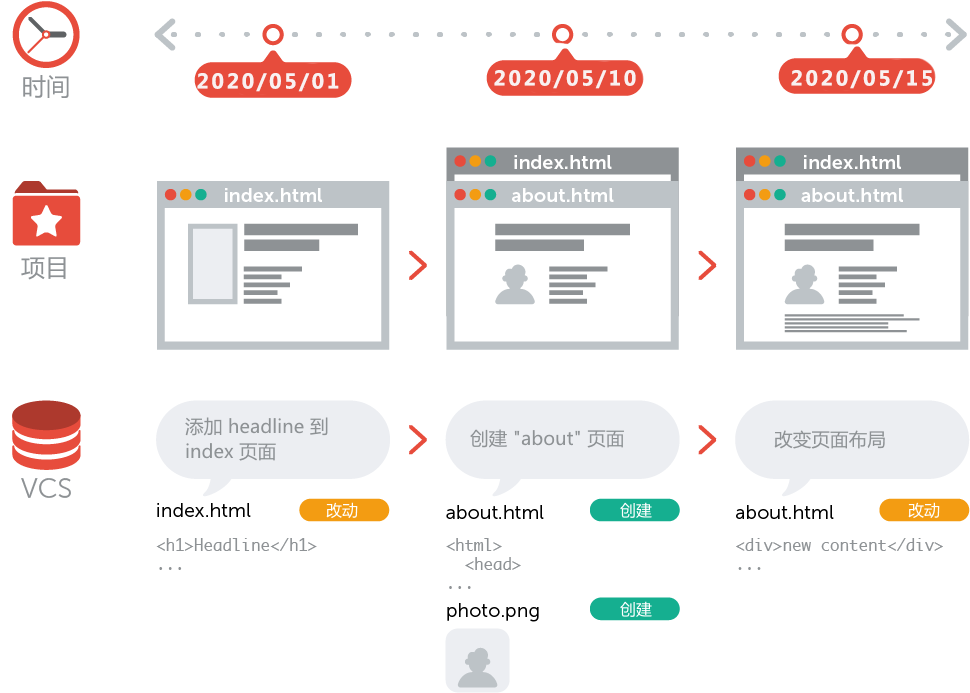

## 1. Git基础  SVN

### 1.1 版本管理

#### 1.1.1 什么是版本管理

版本管理是一种记录文件变化的方式，以便将来查阅特定版本的文件内容。

#### 1.1.2 人为维护文档版本的问题

1. 文档数量多且命名不清晰导致文档版本混乱

2. 每次编辑文档需要复制，不方便

3. 多人同时编辑同一个文档，容易产生覆盖

 

#### 1.1.3 本地版本控制系统

许多人习惯用复制整个项目目录的方式来保存不同的版本，或许还会改名加上备份时间以示区别。 这么做唯一的好处就是简单，但是特别容易犯错。 有时候会混淆所在的工作目录，一不小心会写错文件或者覆盖意想外的文件。

为了解决这个问题，人们很久以前就开发了许多种本地版本控制系统，大多都是采用某种简单的数据库来记录文件的历次更新差异。

 

Figure 1. 本地版本控制.

其中最流行的一种叫做 RCS，现今许多计算机系统上都还看得到它的踪影。 甚至在流行的 Mac OS X 系统上安装了开发者工具包之后，也可以使用 rcs 命令。 它的工作原理是在硬盘上保存补丁集（补丁是指文件修订前后的变化）；通过应用所有的补丁，可以重新计算出各个版本的文件内容。

#### 1.1.4 集中化的版本控制系统

接下来人们又遇到一个问题，如何让在不同系统上的开发者协同工作？ 于是，集中化的版本控制系统（Centralized Version Control Systems，简称 CVCS）应运而生。集中式版本控制系统，版本库都是集中放在一个服务器中，当需要干活的时候需要从服务器中获取最新的版本，然后进行修改，当完成了这次修改之后需要再推送到中央服务器中。SVN是集中式版本管理软件。

 

Figure 2. 集中化的版本控制.

这种做法带来了许多好处，特别是相较于老式的本地 VCS 来说。 现在，每个人都可以在一定程度上看到项目中的其他人正在做些什么。 而管理员也可以轻松掌控每个开发者的权限，并且管理一个 CVCS 要远比在各个客户端上维护本地数据库来得轻松容易。

事分两面，有好有坏。 这么做最显而易见的缺点是中央服务器的单点故障。 如果宕机一小时，那么在这一小时内，谁都无法提交更新，也就无法协同工作。 如果中心数据库所在的磁盘发生损坏，又没有做恰当备份，毫无疑问你将丢失所有数据——包括项目的整个变更历史，只剩下人们在各自机器上保留的单独快照。 本地版本控制系统也存在类似问题，只要整个项目的历史记录被保存在单一位置，就有丢失所有历史更新记录的风险。

#### **1.1.5 分布式版本控制系统**

于是分布式版本控制系统（Distributed Version Control System，简称 DVCS）面世了。 在这类系统中，像 Git、Mercurial、Bazaar 以及 Darcs 等，客户端并不只提取最新版本的文件快照，而是把代码仓库完整地镜像下来。 这么一来，任何一处协同工作用的服务器发生故障，事后都可以用任何一个镜像出来的本地仓库恢复。 因为每一次的克隆操作，实际上都是一次对代码仓库的完整备份。

 

Figure 3. 分布式版本控制. 

更进一步，许多这类系统都可以指定和若干不同的远端代码仓库进行交互。籍此，你就可以在同一个项目中，分别和不同工作小组的人相互协作

分布式主要区别在于不需要一个中央服务器，每个电脑都是一个完整的版本库，自己开发的可以先在自己的电脑中管理，当阶段性汇合的时候再推送给对方，对方就可以看到相符的修改。

和集中式相比，分布式比较安全，每个人的电脑都有完整的版本库，某一个人的电脑坏掉不要紧，可以充其他人那里得到一个完整的版本库，而集中式的重要处理器出现了问题，就需要修复，在此过程中，其他所有人就无法正常的上传与下载。同时git还有强大的分支管理，可以从主线中分出一个分支出来进行开发管理，当这个分支所需要的工作完成的时候又可以merge到主线汇合，特别时候一个项目中的多组并行开发。

### 1.2 Git 简史

同生活中的许多伟大事物一样，Git 诞生于一个极富纷争大举创新的年代。

Linux 内核开源项目有着为数众多的参与者。 绝大多数的 Linux 内核维护工作都花在了提交补丁和保存归档的繁琐事务上（1991－2002年间）。 到 2002 年，整个项目组开始启用一个专有的分布式版本控制系统 BitKeeper 来管理和维护代码。

到了 2005 年，开发 BitKeeper 的商业公司同 Linux 内核开源社区的合作关系结束，他们收回了 Linux 内核社区免费使用 BitKeeper 的权力。 这就迫使 Linux 开源社区（特别是 Linux 的缔造者 Linus Torvalds）基于使用 BitKeeper 时的经验教训，开发出自己的版本系统。 他们对新的系统制订了若干目标：

- 速度

- 简单的设计

- 对非线性开发模式的强力支持（允许成千上万个并行开发的分支）

- 完全分布式

- 有能力高效管理类似 Linux 内核一样的超大规模项目（速度和数据量）

自诞生于 2005 年以来，Git 日臻成熟完善，在高度易用的同时，仍然保留着初期设定的目标。 它的速度飞快，极其适合管理大项目，有着令人难以置信的非线性分支管理系统。

##### **近乎所有操作都是本地执行**

在 Git 中的绝大多数操作都只需要访问本地文件和资源，一般不需要来自网络上其它计算机的信息。 如果你习惯于所有操作都有网络延时开销的集中式版本控制系统，Git 在这方面会让你感到速度之神赐给了 Git 超凡的能量。 因为你在本地磁盘上就有项目的完整历史，所以大部分操作看起来瞬间完成。

举个例子，要浏览项目的历史，Git 不需外连到服务器去获取历史，然后再显示出来——它只需直接从本地数据库中读取。 你能立即看到项目历史。 如果你想查看当前版本与一个月前的版本之间引入的修改，Git 会查找到一个月前的文件做一次本地的差异计算，而不是由远程服务器处理或从远程服务器拉回旧版本文件再来本地处理。

这也意味着你离线或者没有 VPN 时，几乎可以进行任何操作。 如你在飞机或火车上想做些工作，你能愉快地提交，直到有网络连接时再上传。 如你回家后 VPN 客户端不正常，你仍能工作。 使用其它系统，做到如此是不可能或很费力的。 比如，用 Perforce，你没有连接服务器时几乎不能做什么事；用 Subversion 和 CVS，你能修改文件，但不能向数据库提交修改（因为你的本地数据库离线了）。 这看起来不是大问题，但是你可能会惊喜地发现它带来的巨大的不同。

 

##### 总结git

**Git是一个版本控制工具系统，它可以在任何时间点，将文档的状态作为更新记录保存起来，也可以在任何时间点，将更新记录恢复回来。**有了它你就可以将某个文件回溯到之前的状态，甚至将整个项目都回退到过去某个时间点的状态，你可以比较文件的变化细节，查出最后是谁修改了哪个地方，从而找出导致怪异问题出现的原因，又是谁在何时报告了某个功能缺陷等等。 使用版本控制系统通常还意味着，就算你乱来一气把整个项目中的文件改的改删的删，你也照样可以轻松恢复到原先的样子。

### 1.3 Git 安装

GitHub提供桌面客户端，其中包括用于最常见的存储库操作的图形用户界面和用于高级方案的自动更新Git命令行版本。

[GitHub for Windows](https://windows.github.com)

[GitHub for Mac](https://mac.github.com)

[Git for All Platforms](https://git-scm.com)

[官网地址](https://git-scm.com) 

在安装的过程中，所有选项使用默认值即可。

### 1.4 Git 基本工作流程

Git 有三种状态，你的文件可能处于其中之一：**已提交（committed）**、**已修改（modified**）和**已暂存（staged）**。 已提交表示数据已经安全的保存在本地数据库中。 已修改表示修改了文件，但还没保存到数据库中。 已暂存表示对一个已修改文件的当前版本做了标记，使之包含在下次提交的快照中。

 由此引入 Git 项目的三个工作区域的概念：Git 仓库、工作目录以及暂存区域。

| git仓库          | 暂存区             | 工作目录            |
| ---------------- | ------------------ | ------------------- |
| 用于存放提交记录 | 临时存放被修改文件 | 被Git管理的项目目录 |

 

### 1.5 Git 的使用

Git 有多种使用方式。 你可以使用原生的命令行模式，也可以使用 GUI 模式，这些 GUI 软件也能提供多种功能。 我们将使用命令行模式。 这是因为首先，只有在命令行模式下你才能执行 Git 的 所有命令，而大多数的 GUI 软件只实现了 Git 所有功能的一个子集以降低操作难度。 如果你学会了在命令行下如何操作，那么你在操作 GUI 软件时应该也不会遇到什么困难，但是，反之则不成立。 此外，由于每个人的想法与侧重点不同，不同的人常常会安装不同的 GUI 软件，但 所有 人一定会有命令行工具。

假如你是 Mac 用户，我们希望你懂得如何使用终端（Terminal）；假如你是 Windows 用户，我们希望你懂得如何使用命令窗口（Command Prompt）或 PowerShell。

#### 1.5.1 Git 使用前配置

如果系统上安装了 Git，下面就要来定制你的 Git 环境。 每台计算机上只需要配置一次，程序升级时会保留配置信息。 你可以在任何时候再次通过运行命令来修改它们。

Git 自带一个 git config 的工具来帮助设置控制 Git 外观和行为的配置变量。

在使用 Git 前，需要告诉 Git 你是谁，在向 Git 仓库中提交时需要用到。

1. 配置提交人姓名: `git config --global user.name '提交人姓名'`
2. 配置提交人邮箱: `git config --global user.email '提交人邮箱'` 
3. 查看git配置信息: `git config --list`   
4. 删除git配置用户信息: ` git config --global --unset user.email`

**注意**

1. 如果要对配置信息进行修改，重复上述命令即可。
2. 配置只需要执行一次。
3. git help 查看帮助信息

#### 1.5.2 提交步骤

1. `git init` 初始化git仓库

2. `git status` 查看文件状态

3. `git add 文件列表` 追踪(添加到暂存区)文件  再次`git status` 查看文件状态

4. `git commit -m 提交信息`  向仓库中提交代码

5. `git log` 查看提交记录

   注意:将工作目录中的文件全部添加到暂存区：`git add .`
   
   多学一招: DOS窗口命令清屏:cls

#### 1.5.3 撤销

- 用暂存区中的文件覆盖工作目录中的文件： `git checkout 文件名`
- 将文件从暂存区中删除： `git rm --cached 文件名`
- 从工作目录中删除文件并暂存删除操作： `git rm 文件名`(必须是commit的文件,目前在暂存区没有任何修改)
- 将 git 仓库中指定的更新记录恢复出来，并且覆盖暂存区和工作目录：`git reset --hard commitID` 

 

## 2. Git进阶

### 2.1 分支

为了便于理解，大家暂时可以认为分支就是当前工作目录中代码的一份副本。

使用分支，可以让我们从开发主线上分离出来，以免影响开发主线。

 

#### 2.1.1 分支细分

1. 主分支（master）：第一次向 git 仓库中提交更新记录时自动产生的一个分支。

    

2. 、开发分支（develop）：作为开发的分支，基于 master 分支创建。

   

    

3. 功能分支（feature）：作为开发具体功能的分支，基于开发分支创建

   

    

**功能分支 -> 开发分支 -> 主分支**

#### 2.1.2 分支命令

- `git branch` 查看分支

- `git branch 分支名称` 创建分支(把主分支拷贝一份)

- `git checkout 分支名称` 切换分支(切换分支前分支上的文件必须得提交,才可以切换分支)

- `git merge 来源分支` 合并分支

- `git branch -d 分支名称` 删除分支（分支被合并后才允许删除）（-D 强制删除）

### 2.2 暂时保存更改

在git中，可以暂时提取分支上所有的改动并存储，让开发人员得到一个干净的工作副本，临时转向其他工作。

使用场景：分支临时切换

- 存储临时改动(添加到暂存区,然后再保存临时改动)：`git stash`
- 恢复改动：`git stash pop`
- 列出所有已存储的变更集：`git stash list`
- 丢弃最近存储的变更集：`git stash drop`
## 3. Github Gitee

在版本控制系统中，大约90%的操作都是在本地仓库中进行的：暂存，提交，查看状态或者历史记录等等。除此之外，如果仅仅只有你一个人在这个项目里工作，你永远没有机会需要设置一个远程仓库。

只有当你需要和你的开发团队共享数据时，设置一个远程仓库才有意义。你可以把它想象成一个 “文件管理服务器”，利用这个服务器可以与开发团队的其他成员进行数据交换。

### 3.1 注册

1. 访问[github](https://github.com/)首页，点击 Sign up 连接。（注册）

    

2. 填写用户名、邮箱地址、GitHub登陆密码

3. 选择计划

4. 填写 GitHub 问题

5. 验证邮箱

6. GitHub 个人中心

### 3.2 多人协作开发流程

- A在自己的计算机中创建本地仓库
- A在github中创建远程仓库
- A将本地仓库推送到远程仓库
- B克隆远程仓库到本地进行开发
- B将本地仓库中开发的内容推送到远程仓库
- A将远程仓库中的最新内容拉去到本地

 

 

### 3.3 创建仓库

1. 填写仓库基本信息

2. 将本地仓库推送到远程仓库

   1. git push 远程仓库地址 分支名称

       ` git push https://gitee.com/tech_zjp/test-git.git master`

   2. git remote add origin(远程仓库地址别名) 远程仓库地址

       `git remote add origin https://gitee.com/tech_zjp/test-git.git`

   3. git push 远程仓库地址别名 分支名称
   
       `git push origin master`
   
   4. git push -u 远程仓库地址别名 分支名称
   
       -u 记住推送地址及分支，下次推送只需要输入git push即可
       
       `git push -u origin master`
       
       `git push`

### 3.4 拉取操作

#### 3.4.1 克隆仓库

克隆远端数据仓库到本地：`git clone 仓库地址`   不需要身份认证

#### 3.4.2 拉取远程仓库中最新的版本

拉取远程仓库中最新的版本：`git pull 远程仓库地址 分支名称`  读操作不需要身份认证

### 3.5 解决冲突

在多人同时开发一个项目时，如果两个人修改了同一个文件的同一个地方，就会发生冲突。冲突需要人为解决。

### 3.6 ssh免登陆

 

首先输入命令-生成秘钥：`ssh-keygen`

秘钥存储目录：C:\Users\用户\\.ssh

公钥名称：id_rsa.pub

私钥名称：id_rsa

### 3.7 GIT忽略清单

将不需要被git管理的文件名字添加到此文件中，在执行git命令的时候，git就会忽略这些文件。

git忽略清单文件名称：**.gitignore**

-  在需要创建 .gitignore 文件的文件夹, 右键选择Git Bash 进入命令行，进入项目所在目录。

- 输入 `touch .gitignore` 在文件夹就生成了一个“.gitignore”文件

### 3.8 GIT提交空目录

提交空文件结构(在根目录运行): touch .gitignore

## 4. vscode配置git

- ctrl+shift+p 打开命令窗口

- 使用git clone命令 添加项目连接打开在工作目录,下载项目

- 修改项目后,修改文件添加到**暂存更改**

- 点击提交已暂存文件按钮,在命令窗口填写提交记录信息,按下回车提交

- 提交时弹出配置用户名信息(或在终端配置git的用户名和邮箱),填写即可

- 点击推送按钮或者直接点击同步按钮即可

   

