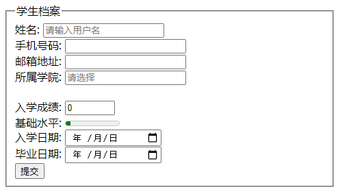

# 1.HTML5新标签与特性

达标：掌握html5的常用新标签-新属性

## 1.1 什么是HTML5

HTML5 ： HTML 标准的最新版本，是对 HTML 的第五次重大修改。HTML5的出现，对于WEB来说意义重大，其目的是想要把目前WEB中存在的各种问题一并解决掉。

两个概念：

是一个新版本的 HTML语言，定义了新的标签、特性和属性。

拥有一个强大的技术集，这些技术集是指： HTML5、CSS3、javascript, 这也是广义上的 HTML5

总之：HTML5就是对HTML4已有标签属性的删除和增加，另外又增加了新的多媒体等标签，解决目前WEB上存在的问题。

HTML5 中的一些有趣的新特性：

- 用于绘画的 canvas 元素
- 用于媒介回放的 video 和 audio 元素
- 对本地离线存储的更好的支持
- 新的特殊内容元素，比如 article、footer、header、nav、section
- 新的表单控件，比如 date、time、email、url、search

## 1.2 语法的改变

- DOCTYPE声明 
- 指定字符编码
- 可以省略结束标记
- 具有boolean值的属性（disabled，checked）
- 标签属性的值可以省略引号
- 等等

## 1.3 新增语义化标签

w3c 手册中文官网：http://www.w3school.com.cn/

- header：定义文档的页眉,用来表示页面的头部。

- nav：定义导航链接的部分nav 元素代表页面中的导航，其中的导航元素链接到其他页面或当前页面的其他部分。

- main：主体信息

- aside : 侧边栏

- article：article元素表示文档、页面或应用程序中独立的、完整的、可以独自被外部引用的内容。它可以是一篇博客或报纸中的文章、一篇论坛帖子、一段用户评论或独立的插件，或其他任何独立的内容。

- section：定义文档中的节（section、区段）

- footer：定义文档或节的页脚

- datalist：标签定义选项列表。请与 input 元素配合使用该元素，其中input的list属性值必须和datalist的id值一致。（修改后要刷新页面）

- figure元素：该元素用于表示一块独立的图片区域，元素内部可以包含一个或多个元素。另外，该元素还可以包含一个<figcaption>元素，用于定义该图盘区域的标题。

- figcaption元素：该元素通常放在<figure>内部，用于定义图片区域的标题。

- fieldset：可将表单内相关元素分组，与legend 配合使用

- meter: 使用 meter 元素来度量给定范围（gauge）内的数据

  ```html
  <meter value="3" min="0" max="10">十分之三</meter>
  ```

- progress: 标签定义运行中的进度（进程）

  ```html
  <progress value="3" min="0" max="10"></progress>
  ```

## 1.4 常用新属性

| **属性******     | **用法******                                                | **含义******                                                 |
| ---------------- | ----------------------------------------------------------- | ------------------------------------------------------------ |
| **placeholder**  | <input type="text" placeholder="请输入用户名">              | 占位符提供可描述输入字段预期值的提示信息                     |
| **autofocus**    | <input type="text" autofocus>                               | 规定当页面加载时 input 元素应该自动获得焦点                  |
| **multiple**     | <input type="file" multiple>                                | 多文件上传                                                   |
| **autocomplete** | <input type="text" autocomplete="on" name="auto">           | 规定表单是否应该启用自动完成功能，on默认，启用自动完成（name必须，提交按钮必须）.(当用户在字段开始键入时，浏览器基于之前键入过的值) |
| **required**     | <input type="text" required>                                | 必填项                                                       |
| **accesskey**    | <input type="text" accesskey="s">                           | 规定激活（使元素获得焦点）元素的快捷键,Alt+S键               |
| **tabindex**     | `<button tabindex="2">点我</button>`                        | 指定获取焦点的顺序                                           |
| **data-***       | <div id="box" data-user-name="张美丽">box</div>             | 自定义标签属性                                               |
| **pattern**      | <input type="text" name="country_code" pattern="[A-z]{3}"/> | 属性规定用于验证输入字段的模式。<br />适用于以下 <input> 类型：text, search, url, tel, email 以及 password 。 |

**注意**

自动完成允许浏览器预测对字段的输入。当用户在字段开始键入时，浏览器基于之前键入过的值，应该显示出在字段中填写的选项。

注释：autocomplete 属性适用于 ‘ form’，以及下面的 ‘input’ 类型：text, search, url, telephone, email, password, datepickers, range 以及 color。

## 1.5 新增的input的type属性值(重点)

| **类型****** | **使用示例******      | **含义******         |
| ------------ | --------------------- | -------------------- |
| **email**    | <input type="email">  | 输入邮箱格式         |
| **tel**      | <input type="tel">    | 输入手机号码格式     |
| **url**      | <input type="url">    | 输入url格式          |
| **number**   | <input type="number"> | 输入数字格式         |
| **search**   | <input type="search"> | 搜索框（体现语义化） |
| **range**    | <input type="range">  | 自由拖动滑块         |
| **time**     | <input type="time">   |                      |
| **date**     | <input type="date">   |                      |
| **month**    | <input type="month">  |                      |
| **week**     | <input type="week">   |                      |

## 综合案例

 


~~~html
<form action="">
  <fieldset>
    <legend>学生档案</legend>
    <label for="userName">姓名:</label>
    <input type="text" name="userName" id="userName" placeholder="请输入用户名"> <br>
    <label for="userPhone">手机号码:</label>
    <input type="tel" name="userPhone" id="userPhone" pattern="^1\d{10}$"><br>
    <label for="email">邮箱地址:</label>
    <input type="email" required name="email" id="email"><br>
    <label for="collage">所属学院:</label>
    <input type="text" name="collage" id="collage" list="cList" placeholder="请选择"><br>
    <datalist id="cList">
      <option value="前端与移动开发学院"></option>
      <option value="java学院"></option>
      <option value="c++学院"></option>
    </datalist><br>
    <label for="score">入学成绩:</label>
    <input type="number" max="100" min="0" value="0" id="score"><br>
    <label for="level">基础水平:</label>
    <meter id="level" value="10" max="100" min="0" low="59" high="90"></meter><br>
    <label for="inTime">入学日期:</label>
    <input type="date" id="inTime" name="inTime"><br>
    <label for="leaveTime">毕业日期:</label>
    <input type="date" id="leaveTime" name="leaveTime"><br>
    <input type="submit">
  </fieldset>
</form>
~~~

## 1.6 多媒体标签

- embed：标签定义嵌入的内容

- audio：播放音频

- video：播放视频


### 1.6.1 多媒体 embed（会使用）

embed可以用来插入各种多媒体，格式可以是 Midi、Wav、AIFF、AU、MP3等等。url为音频或视频文件及其路径，可以是相对路径或绝对路径。我们这里只讲解 插入网络视频， 后面H5会讲解 audio 和video 视频多媒体。 

```html
<embed height=498 width=510 src='https://player.youku.com/embed/XNTE4NDgxOTQyOA=='  frameborder=0 'allowfullscreen'></embed>
```


 

 优酷，土豆，爱奇艺，腾讯、乐视等等

1. 先上传   
2. 在分享

### 1.6.2 多媒体 audio

HTML5通过<audio>标签来解决音频播放的问题。

使用相当简单，如下图所示

 

并且可以通过附加属性可以更友好控制音频的播放，如：

controls 是否显不默认播放控件

autoplay 自动播放(目前很多浏览器不支持自动播放)

loop 循环播放

由于版权等原因，不同的浏览器可支持播放的格式是不一样的，如下图供参考

 

多浏览器支持的方案，如下图

 


### 1.6.3 多媒体 video

HTML5通过<video>标签来解决音频播放的问题。

同音频播放一样，<video>使用也相当简单，如下图

 

同样，通过附加属性可以更友好的控制视频的播放

autoplay 自动播放（18年开始，谷歌浏览器不支持自动播放）

muted 静音播放

controls 是否显示默认播放控件

loop 循环播放

width 设置播放窗口宽度

height 设置播放窗口的高度

由于版权等原因，不同的浏览器可支持播放的格式是不一样的，如下图供参考

 

**多浏览器支持的方案，如下图******

 


# 2.字体图标

图片是有诸多优点的，但是缺点很明显，比如图片不但增加了总文件的大小，还增加了很多额外的"http请求"，这都会大大降低网页的性能的。更重要的是图片不能很好的进行“缩放”，因为图片放大和缩小会失真。 我们后面会学习移动端响应式，很多情况下希望我们的图标是可以缩放的。此时，一个非常重要的技术出现了，额不是出现了，是以前就有，是被从新"宠幸"啦。。 这就是字体图标（iconfont).

## 2.1 字体图标优点

> 可以做出跟图片一样可以做的事情,改变透明度、旋转度，等..
>
> 但是本质其实是文字，可以很随意的改变颜色、产生阴影、透明效果等等...
>
> 本身体积更小，但携带的信息并没有削减。
>
> 几乎支持所有的浏览器
>
> 移动端设备必备良药...

## 2.2 字体图标使用流程

总体来说，字体图标按照如下流程：


### 2.3 设计字体图标

假如图标是我们公司单独设计，那就需要第一步了，这个属于UI设计人员的工作， 他们在 illustrator 或 Sketch 这类矢量图形软件里创建 icon图标， 比如下图：

 

  之后保存为svg格式，然后给我们前端人员就好了。 

  其实第一步，我们不需要关心，只需要给我们这些图标就可以了，如果图标是大众的，网上本来就有的，可以直接跳过第一步，进入第三步。

### 2.4 上传生成字体包

当UI设计人员给我们svg文件的时候，我们需要转换成我们页面能使用的字体文件， 而且需要生成的是兼容性的适合各个浏览器的。

**阿里icon font字库**

http://www.iconfont.cn/

这个是阿里巴巴M2UX的一个icon font字体图标字库，包含了淘宝图标库和阿里妈妈图标库。可以使用AI制作图标上传生成。 一个字，免费，免费！！

**icomoon字库**

IcoMoon成立于2011年，推出的第一个自定义图标字体生成器，它允许用户选择他们所需要的图标，使它们成一字型。 内容种类繁多，非常全面，唯一的遗憾是国外服务器，打开网速较慢。

http://www.iconfont.cn/

**fontello**

[http://fontello.com/](http://fontello.com/)

在线定制你自己的icon font字体图标字库，也可以直接从GitHub下载整个图标集，该项目也是开源的。

**Font-Awesome**

[http://fortawesome.github.io/Font-Awesome/](http://fortawesome.github.io/Font-Awesome/)

这是我最喜欢的字库之一了，更新比较快。目前已经有369个图标了。

**Glyphicon Halflings**

[http://glyphicons.com/](http://glyphicons.com/)

这个字体图标可以在Bootstrap下免费使用。自带了200多个图标。

**Icons8**

[https://icons8.com/](https://icons8.com/)

提供PNG免费下载，像素大能到500PX

 

### 2.5 下载兼容字体包

刚才上传完毕， 网站会给我们把UI做的svg图片转换为我们的字体格式， 然后下载下来就好了

当然，我们不需要自己专门的图标，是想网上找几个图标使用，以上2步可以直接省略了， 直接到刚才的网站上找喜欢的下载使用吧。


 

 

### 2.6 字体引入到HTML

得到压缩包之后，最后一步，是最重要的一步了， 就是字体文件已经有了，我们需要引入到我们页面中。

1. 首先把 以下4个文件放入到 fonts文件夹里面。 通俗的做法

    

   ##### 第一步：在样式里面声明字体： 告诉别人我们自己定义的字体

   ```css
   @font-face {
     font-family: 'icomoon';
     src:  url('fonts/icomoon.eot?7kkyc2');
     src:  url('fonts/icomoon.eot?7kkyc2#iefix') format('embedded-opentype'),
       url('fonts/icomoon.ttf?7kkyc2') format('truetype'),
       url('fonts/icomoon.woff?7kkyc2') format('woff'),
       url('fonts/icomoon.svg?7kkyc2#icomoon') format('svg');
     font-weight: normal;
     font-style: normal;
   }
   ```

   ##### 第二步：给盒子使用字体

   ```css
   span {
       font-family: "icomoon";
   }
   ```

   ##### 第三步：盒子里面添加结构, 参考下载实例

   ```css
   span::before {
       content: "\e900";
   }
   或者  
   <span>&#xe603;</span>  
   ```

   ### 追加新图标到原来库里面

   如果工作中，原来的字体图标不够用了，我们需要添加新的字体图标，但是原来的不能删除，继续使用，此时我们需要这样做

   把压缩包里面的selection.json 从新上传，然后，选中自己想要新的图标，从新下载压缩包，替换原来文件即可。

    


# 3.网站上线流程

- 一、买主机(服务器)
- 二、买域名
- 三、备案
- 四、域名解析
- 五、上传网站程序

## 网站收录

百度：https://ziyuan.baidu.com/linksubmit/url

搜狗：http://fankui.help.sogou.com/

360：http://info.so.360.cn/

站长之家：http://www.webmasterhome.cn/seo/addurl.asp
