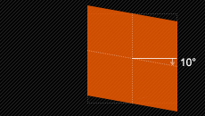

# CSS3中2D和3D的使用

## 1. 过渡(CSS3) transition

过渡（transition)是CSS3中具有颠覆性的特征之一，我们可以在不使用 Flash 动画或 JavaScript 的情况下，当元素从一种样式变换为另一种样式时为元素添加效果。

帧动画：通过一帧一帧的画面按照固定顺序和速度播放。如电影胶片

 

在CSS3里使用transition可以实现补间动画（过渡效果），并且当前元素只要有“属性”发生变化时即存在两种状态(我们用A和B代指），就可以实现平滑的过渡，为了方便演示采用hover切换两种状态，但是并不仅仅局限于hover状态来实现过渡。

语法格式:

```css
transition: 要过渡的属性  花费时间  运动曲线  何时开始;
如果有多组属性变化，还是用逗号隔开。
```

| 属性                       | 描述                                         | CSS  |
| -------------------------- | -------------------------------------------- | ---- |
| transition                 | 简写属性，用于在一个属性中设置四个过渡属性。 | 3    |
| transition-property        | 规定应用过渡的 CSS 属性的名称。              | 3    |
| transition-duration        | 定义过渡效果花费的时间。默认是 0。           | 3    |
| transition-timing-function | 规定过渡效果的时间曲线。默认是 "ease"。      | 3    |
| transition-delay           | 规定过渡效果何时开始。默认是 0。             | 3    |

如果想要所有的属性都变化过渡， 写一个all 就可以

- transition-duration  花费时间  单位是  秒     s    比如 0.5s    这个s单位必须写      ms 毫秒

运动曲线   默认是 ease

何时开始  默认是 0s  立马开始

运动曲线示意图：

 

```css
div {
    width: 200px;
    height: 100px;
    background-color: pink;
    /* transition: 要过渡的属性  花费时间  运动曲线  何时开始; */
    transition: width 0.6s ease 0s, height 0.3s ease-in 1s;
    /* transtion 过渡的意思  这句话写到div里面而不是 hover里面 */
    /* transition: all 0.6s;   所有属性都变化用all 就可以了  后面俩个属性可以省略 */		
}
div:hover {  
    /* 鼠标经过盒子，我们的宽度变为400 */
    width: 600px;
    height: 300px
}
```

###  手风琴案例

## 2. 2D变形(CSS3) transform

transform是CSS3中具有颠覆性的特征之一，可以实现元素的位移、旋转、倾斜、缩放，甚至支持矩阵方式，配合过渡和即将学习的动画知识，可以取代大量之前只能靠Flash才可以实现的效果。

变形转换transform 变换 变形的意思《 transformers 变形金刚》

### 2.1 移动 translate(x, y)    

translate 移动平移的意思

 

```css
translate(50px,50px);
```

使用translate方法来将文字或图像在水平方向和垂直方向上分别移动。

可以改变元素的位置，x、y可为负值；

```css
 translate(x,y)水平方向和垂直方向同时移动（也就是X轴和Y轴同时移动）
 translateX(x)仅水平方向移动（X轴移动）
 translateY(Y)仅垂直方向移动（Y轴移动）
```

#### 应用页面效果

```css
.btn{
    width: 290px;
    height: 85px;
    background: url(images/btn.png) no-repeat;
    margin:300px auto;
    transition: transform 1s;
}
.btn:hover{
    transform: translate(0,-10px);
}
```
#### 商城类展示效果

```css
.con1{
    width: 235px;
    height: 291px;
    background: url(images/xiaomi6.png);
    transition: transform 0.6s;
    margin: 300px auto;
}
.con1:hover{
    transform: translateY(-10px);
    box-shadow: 3px 3px 5px #ddd;
}
```


#### 让定位的盒子水平居中

```css
.box {
  width: 500px;
  height: 400px;
  background: pink;
  position: absolute;
  left:50%;
  top:50%;
  transform:translate(-50%,-50%);  /* 走的自己的一半 */
}
```
### 2.2 缩放 scale(x, y) （0~1）

 

```css
transform:scale(0.8,1);
```

可以对元素进行水平和垂直方向的缩放。该语句使用scale方法使该元素在水平方向上缩小了20%，垂直方向上不缩放。

```css
scale(X,Y)使元素水平方向和垂直方向同时缩放（也就是X轴和Y轴同时缩放）
scaleX(x)元素仅水平方向缩放（X轴缩放）
scaleY(y)元素仅垂直方向缩放（Y轴缩放）
```

 scale()的取值默认的值为1，当值设置为0.01到0.99之间的任何值，作用使一个元素缩小；而<font color="red"> 任何大于或等于1.01的值</font>，作用是让元素放大

### 2.3 旋转 rotate(deg) 

| 语法            | 意义                             |
| --------------- | -------------------------------- |
| rotate(*angle*) | 定义 2D 旋转，在参数中规定角度。 |

可以对元素进行旋转，正值为顺时针，负值为逆时针；

 

```css
transform:rotate(45deg);
```

 注意单位是 deg 度数  	

#### 旋转风车

```css
.box{
    width: 360px;
    height: 360px;
    margin: 50px auto;
    transition: transform 10s ;

}
.box div{
    height: 150px;
    width: 150px;
    background-color: #9BE22D;
    float: left;
    border: 1px solid #000;
    margin: 14px;
}
.box:hover{
    transform: rotate(3600deg);
}
.div1{
    border-radius: 0px 150px 0px 150px;
}
.div2{
    border-radius: 150px 0px 150px 0px;
}
.div3{
    border-radius: 150px 0px 150px 0px;
}
.div4{
    border-radius: 0px 150px 0px 150px;
}

```


### 2.4 倾斜 skew(deg, deg) 

 

```css
transform:skew(30deg,0deg);
```

该实例通过skew方法把元素水平方向上倾斜30度，处置方向保持不变。

可以使元素按一定的角度进行倾斜，可为负值，第二个参数不写默认为0。

- skew（30deg，0）：是表示只在X轴(方向)倾斜，逆时针旋转　

- skew（-30deg，0）：是表示只在X轴(方向)倾斜，顺时针旋转　　

- skew（0，30deg）：是表示只在Y轴(方向)倾斜，顺时针旋转　

- skew（0，-30deg）：是表示只在Y轴(方向)倾斜，逆时针旋转

  　　

1、skewX() ： 按给定的角度沿X轴指定斜切变换。skewX是使元素以其中心为基点，并在水平方向（X轴）进行扭曲变行。如：transform:skewX(30deg)

 

2、skewY() ： 按给定的角度沿Y轴指定斜切变换。skewY是用来设置元素以其中心为基点并按给定的角度在垂直方向（Y轴）扭曲变形。如：transform:skewY（10deg）

 

### 2.5 transform-origin 变形的原点

 

```css
transform-origin: x-axis y-axis;
```

| 名称   | 值   | 描述                                                   |
| ------ | ---- | ------------------------------------------------------ |
| x-axis | 位置 | （left、center、right）/ 百分数 / 数值	x 轴基点坐标 |
| y-axis | 位置 | （top、center、bottom）/ 百分数 / 数值	y 轴基点坐标 |

```css
div{
    transform-origin: left top;
    transform: rotate(45deg); 
}  /* 改变元素原点到左上角，然后进行顺时旋转45度 */    
```

 如果是4个角，可以用 left top这些，如果想要精确的位置， 可以用  px 像素。

```css
 div{transform-origin: 10px 10px;transform: rotate(45deg); }  /* 改变元素原点到x 为10  y 为10，然后进行顺时旋转45度 */ 
```


## 3. 3D变形(CSS3) transform

2d    x  y  

3d  x  y  z

CSS3中的3D坐标系与上述的3D坐标系是有一定区别的，相当于其绕着X轴旋转了180度，如下图

 

简单记住他们的坐标：

 x左边是负的，右边是正的

y 上面是负的， 下面是正的

z 里面是负的， 外面是正的

或者用左手法则也行：**伸出左手，大拇指指向正轴方向，四个手指的指向即是旋转正向，但务必记住是左手！**为正顺时针旋转，为负，逆时针旋转。

### 3.1 rotateX() 

 就是沿着 x 立体旋转.

 

```css
img {
  transition:all 0.5s ease 0s;
}
img:hover {

  transform:rotateX(180deg);
}
```

### 3.2 rotateY()

沿着y轴进行旋转

 

```css
img {
  transition:all 0.5s ease 0s;
}
img:hove {

  transform:rotateX(180deg);
}
```

### 3.3 rotateZ()

沿着z轴进行旋转

```css
img {
  transition:all .25s ease-in 0s;
}
img:hover {
  /* transform:rotateX(180deg); */
  /* transform:rotateY(180deg); */
  /* transform:rotateZ(180deg); */
  /* transform:rotateX(45deg) rotateY(180deg) rotateZ(90deg) skew(0,10deg); */
}
```

### 3.4 透视(perspective)

电脑显示屏是一个2D平面，图像之所以具有立体感（3D效果），其实只是一种视觉呈现，通过透视可以实现此目的。

透视可以将一个2D平面，在转换的过程当中，呈现3D效果。

- 透视原理： 近大远小 。
- 浏览器透视：把近大远小的所有图像，透视在屏幕上。
- perspective：视距，表示视点距离屏幕的长短。视点，用于模拟透视效果时人眼的位置

注：并非任何情况下需要透视效果，根据开发需要进行设置。

perspective 一般作为一个属性，设置给父元素，作用于所有3D转换的子元素

理解透视距离原理：

 


### 3.4 backface-visibility (了解)

属性定义当元素不面向屏幕时是否可见，如果在旋转元素不希望看到其背面时，该属性很有用。

| 值              | 描述             |
| --------------- | ---------------- |
| visible（默认） | 背面是可见的。   |
| hidden          | 背面是不可见的。 |

### 开门案例

###  3.6 transform-style

语法：

```css
transform-style: flat|preserve-3d;
```

| 值          | 描述                       |
| ----------- | -------------------------- |
| flat        | 子元素将不保留其 3D 位置。 |
| preserve-3d | 子元素将保留其 3D 位置。   |

### 3.7 translateX(x)

仅水平方向移动**（X轴移动） 

 

主要目的实现移动效果

### 3.8 translateY(y)

仅垂直方向移动（Y轴移动）

 

### 3.9 translateZ(z)

transformZ的直观表现形式就是大小变化，实质是XY平面相对于视点的远近变化（说远近就一定会说到离什么参照物远或近，在这里参照物就是perspective属性）。比如设置了perspective为200px;那么transformZ的值越接近200，就是离的越近，看上去也就越大，超过200就看不到了，因为相当于跑到后脑勺去了，我相信你正常情况下，是看不到自己的后脑勺的。

### 3.10 translate3d(x,y,z)

[注意]其中，x和y可以是长度值，也可以是百分比，百分比是相对于其本身元素水平方向的宽度和垂直方向的高度和；z只能设置长度值


## 4. 动画(CSS3) animation

动画是CSS3中具有颠覆性的特征之一，可通过设置多个节点来精确控制一个或一组动画，常用来实现复杂的动画效果。

语法格式：

```css
animation:动画名称 动画时间 运动曲线  何时开始  播放次数  是否反方向;
```

 

关于几个值，除了名字，动画时间，延时有严格顺序要求其它随意

```css
@keyframes 动画名称 {
  from{ 开始位置 }  0%
  to{  结束  }  100%
}
```

```css
animation-iteration-count:infinite;  无限循环播放
animation-play-state:paused;   暂停动画
animation-direction:alternate;(动画交替反向运行)alternate-reverse;(动画反向交替运行)reverse(动画反向);
```

### 小汽车案例

```css
body {
  background: white;
}
img {
  width: 200px;
}
.animation {
  animation-name: goback;
  animation-duration: 5s;
  animation-timing-function: ease;
  animation-iteration-count: infinite;
}
@keyframes goback {
  0%{}
  49%{
    transform: translateX(1000px);
  }
  55%{
    transform: translateX(1000px) rotateY(180deg);
  }
  95%{
    transform: translateX(0) rotateY(180deg);
  }
  100%{
    transform: translateX(0) rotateY(0deg);
  }
}
```

### 综合案例案例-旋转相册


