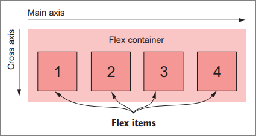

# 1. 传统布局和flex布局对比

## 1.1 传统布局

- 兼容性好
- 布局繁琐
- 局限性，不能再移动端很好的布局

## 1.2 flex布局

- 操作方便，布局极其简单，移动端使用比较广泛
- pc端浏览器支持情况比较差
- IE11或更低版本不支持flex或仅支持部分

## 1.3 建议

- 如果是pc端页面布局，还是采用传统方式
- 如果是移动端建议，采用flex

# 2. Flex 布局是什么？

Flex 是 Flexible Box 的缩写，意为"弹性布局"，用来为盒状模型提供最大的灵活性。

<font color='red'>任何一个容器</font>都可以指定为 Flex 布局。(芸芸众生皆平等)

```css
.box {
	display: flex;
}
```

行内元素也可以使用 Flex 布局。

```css
.box {
	display: inline-flex;
}
```


注意，设为 Flex 布局以后，子元素的float、clear和vertical-align属性将失效。

# 3. 基本概念

采用 Flex 布局的元素，称为 Flex 容器（flex container），简称"容器"。它的所有子元素自动成为容器成员，称为 Flex 项目（flex item），简称"项目"。

- 父盒子是：flex container

- 子元素是：flex item
- 总结原理：就是给父盒子添加flex属性，来控制子盒子的位置和排列方式

 

 

- 容器默认存在两根轴：水平的主轴（main axis）和垂直的交叉轴（cross axis）。主轴的开始位置（与边框的交叉点）叫做main start，结束位置叫做main end；交叉轴的开始位置叫做cross start，结束位置叫做cross end。
  
- 项目默认沿主轴排列。单个项目占据的主轴空间叫做main size，占据的交叉轴空间叫做cross size。

# 4. 容器的属性


以下6个属性设置在容器上（父盒子）。

-   flex-direction:属性决定主轴的方向（即项目的排列方向）。

-   flex-wrap:如果一条轴线排不下，如何换行

-   flex-flow:是flex-direction属性和flex-wrap属性的简写形式，默认值为row nowrap。

-   justify-content:属性定义了项目在主轴上的对齐方式。

-   align-items:属性定义项目在交叉轴上如何对齐。

-   align-content:属性定义了多根轴线的对齐方式。如果项目只有一根轴线，该属性不起作用。

4.1 flex-direction属性（主轴的方向）
----------------------

flex-direction属性决定主轴的方向（即项目的排列方向）。

 

```css
.box {
    flex-direction: row | row-reverse | column | column-reverse;
}
```

它可能取有4个值：

- row（默认值）：主轴为水平方向，起点在左端。
- row-reverse：主轴为水平方向，起点在右端。
- column：主轴为垂直方向，起点在上沿。
- column-reverse：主轴为垂直方向，起点在下沿。

 

 

 

 


4.2 flex-wrap属性（如何换行）
-----------------

默认情况下，项目都排在一条线（又称"轴线"）上。flex-wrap属性定义，如果一条轴线排不下，如何换行。

 

```css
.box{
    flex-wrap: nowrap（默认） | wrap | wrap-reverse;
}
```


它可能取三个值。

（1）nowrap（默认）：不换行。

 

（2）wrap：换行，第一行在上方。

 

（3）wrap-reverse：换行，第一行在下方。

 

4.3 flex-flow（flex-direction属性和flex-wrap属性的简写）
-------------

flex-flow属性是flex-direction属性和flex-wrap属性的简写形式，默认值为row nowrap。

```css
.box {
    flex-flow: <flex-direction> || <flex-wrap>;
}
```


4.4 justify-content属性（主轴上的对齐方式）
-----------------------

justify-content属性定义了项目在主轴上的对齐方式。

```css
.box {
    justify-content: flex-start(默认值) | flex-end | center | space-between | space-around;
}
```

它可能取5个值，具体对齐方式与轴的方向有关。下面假设主轴为从左到右。

- flex-start（默认值）：左对齐
- flex-end：右对齐
- center： 居中
- space-between：两端对齐，项目之间的间隔都相等。
- space-around：每个项目两侧的间隔相等。所以，项目之间的间隔比项目与边框的间隔大一倍。

 


4.5 align-items属性（副轴上如何对齐）
-------------------

align-items属性定义项目在副轴上如何对齐。

```css
.box {
  align-items: flex-start | flex-end | center | baseline | stretch;
}
```

它可能取5个值。具体的对齐方式与交叉轴的方向有关，下面假设交叉轴从上到下。

- flex-start：交叉轴的起点对齐。
- flex-end：交叉轴的终点对齐。
- center：交叉轴的中点对齐。
- baseline: 项目的第一行文字的基线对齐。
- stretch（默认值）：如果项目未设置高度或设为auto，将占满整个容器的高度，元素被拉伸以适应容器。。

 


4.6 align-content属性（多根轴线的对齐方式）
---------------------

align-content属性定义了多根轴线的对齐方式。如果项目只有一根轴线，该属性不起作用。

```css
.box {
    align-content: stretch(默认) |flex-start | flex-end | center |space-between | space-around 
}
```


 

该属性可能取6个值。

-   flex-start：与交叉轴的起点对齐。

-   flex-end：与交叉轴的终点对齐。

-   center：与交叉轴的中点对齐。

-   space-between：与交叉轴两端对齐，轴线之间的间隔平均分布。

-   space-around：每根轴线两侧的间隔都相等。所以，轴线之间的间隔比轴线与边框的间隔大一倍。

-   stretch（默认值）：轴线占满整个交叉轴。

# 5. 弹性子元素属性

| 值          | 描述                                                         |
| ------------------ | ------------------------------------------------- |
| flex-grow   | 一个数字，规定项目将相对于其他元素进行扩展的量。             |
| flex-shrink | 一个数字，规定项目将相对于其他元素进行收缩的量。             |
| flex-basis  | 项目的长度。合法值："auto"、"inherit" 或一个后跟 "%"、"px"、"em" 或任何其他长度单位的数字。 |
| auto        | 与 1 1 auto 相同。                                           |
| none        | 与 0 0 auto 相同。                                           |
| initial     | 设置该属性为它的默认值，即为 0 1 auto。                      |
| inherit     | 从父元素继承该属性。                                         |

5.1 order属性（项目的排列顺序）
-------------

order属性定义项目的排列顺序。数值越小，排列越靠前，默认为0。

```css
.item {
    order: <integer>;
}
```


 

5.2 flex-grow属性（放大比例）
-----------------

flex-grow属性定义项目的放大比例，默认为0，即如果存在剩余空间，也不放大。

```css
.item {
  flex-grow: <number>; /* default 0 */
}
```

 

如果所有项目的flex-grow属性都为1，则它们将等分剩余空间（如果有的话）。如果一个项目的flex-grow属性为2，其他项目都为1，则前者占据的剩余空间将比其他项多一倍。

5.3 flex-shrink属性（缩小比例）
-------------------

flex-shrink属性定义了项目的缩小比例，默认为1，即如果空间不足，该项目将缩小。值越大，越缩小

```css
.item {
    flex-shrink: <number>; /* default 1 */
}
```

 

- 如果所有项目的flex-shrink属性都为1，当空间不足时，都将等比例缩小。如果一个项目的flex-shrink属性为0，其他项目都为1，则空间不足时，前者不缩小。

- 负值对该属性无效。

5.4 flex-basis属性（项目占据的主轴空间）
------------------

flex-basis属性定义了在分配多余空间之前，项目占据的主轴空间（main size）。浏览器根据这个属性，计算主轴是否有多余空间。它的默认值为auto，即项目的本来大小。

```css
.item {
    flex-basis: <length> | auto; /* default auto */
}
```


它可以设为跟width或height属性一样的值（比如350px），则项目将占据固定空间。

5.5 flex属性（flex-grow, flex-shrink 和 flex-basis的简写）
------------

flex属性是flex-grow, flex-shrink 和 flex-basis的简写，默认值为0 1 auto,后两个属性可选。

```css
.item {
    flex: 0 1 auto | [ <'flex-grow'> <'flex-shrink'>? || <'flex-basis'> ]
}

```


该属性有两个快捷值：auto (1 1 auto) 和 none (0 0 auto)。

建议优先使用这个属性，而不是单独写三个分离的属性，因为浏览器会推算相关值。

| 值          | 描述                                                         |
| ----------- | ------------------------------------------------------------ |
| flex-grow   | 一个数字，规定项目将相对于其他元素进行扩展的量。默认0        |
| flex-shrink | 一个数字，规定项目将相对于其他元素进行收缩的量。默认1        |
| flex-basis  | 项目的长度。合法值："auto"、"inherit" 或一个后跟 "%"、"px"、"em" 或任何其他长度单位的数字。 |
| auto        | 与 1 1 auto 相同。<font color="red">也可以扩大，也可以缩小</font>（flex-grow 1，flex-shrink 1,flex-basis auto） |
| none        | 与 0 0 auto 相同。<font color="red">不扩大也不缩小</font>（flex-grow 0，flex-shrink 0,flex-basis auto） |
| 1           | **flex:1**（flex-grow 1， flex-shrink 1, flex-basis 0%）     |
| initial     | 设置该属性为它的默认值，即为 0 1 auto。                      |

5.6 align-self属性（不一样的对齐方式）
------------------

align-self属性允许单个项目有与其他项目不一样的对齐方式，可覆盖align-items属性。默认值为auto，表示继承父元素的align-items属性，如果没有父元素，则等同于stretch。

```css
.item {
    align-self: auto | flex-start | flex-end | center | baseline | stretch;
}
```

 

该属性可能取6个值，除了auto，其他都与align-items属性完全一致。

### 总结

|属性|	描述|
| ----------- | ------------------------------------------------------------ |
|flex-direction| 主轴的方向 |
|justify-content| 设置弹性盒子元素在主轴方向上的对齐方式 |
|align-items| 设置弹性盒子元素在交叉轴方向上的对齐方式 |
|flex-wrap|	设置弹性盒子元素超出父容器是否换行|
|align-content| 多根轴线对齐方式 |
|flex-flow|	flex-direction和 flex-wrap的结合|
|order|	设置弹性盒子的子元素的排列方式|
|align-self|	在弹性子元素上使用，覆盖align-items属性|
|flex:1| **flex:1**（flex-grow 1， flex-shrink 1,flex-basis 0%） |
