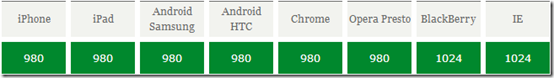
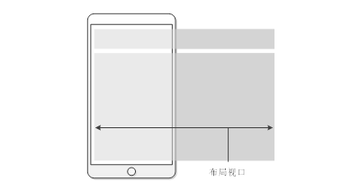
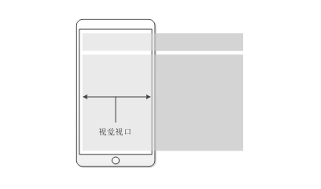
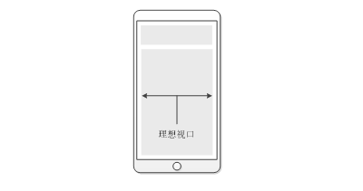
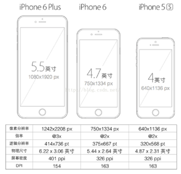
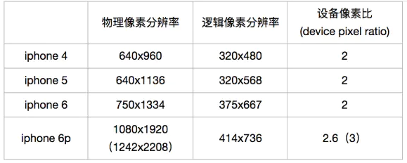
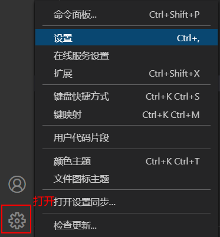
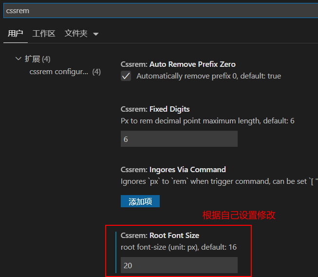

# 1. 移动端常见布局

移动端单独制作

+ 流式布局（百分比布局）

  - 流式布局，就是百分比布局，也称非固定像素布局。

  - 通过盒子的宽度设置成百分比来根据屏幕的宽度来进行伸缩，不受固定像素的限制，内容向两侧填充。

  - 流式布局方式是移动web开发使用的比较常见的布局方式。

+ flex 弹性布局（强烈推荐）

+ less+rem+媒体查询布局

+ 混合布局

响应式

+ 媒体查询

+ bootstarp

# 2. 布局视口、视觉视口、理想视口

## 2.1 布局视口(layout viewport)

  - layout viewport(布局视口)：在PC端上，布局视口等于浏览器窗口的宽度。而在移动端上，由于要使为PC端浏览器设计的网站能够完全显示在移动端的小屏幕里，此时的布局视口会远大于移动设备的屏幕，就会出现滚动条。

     

  - js获取布局视口：**document.documentElement.clientWidth | document.body.clientWidth；**

      

    当网页的宽度大于以上的值时，就会出现横向滚动条。

  ## 2.2 视觉视口(visual viewport)

  - visual viewport(视觉视口)：用户正在看到的网页的区域。用户可以通过缩放来查看网站的内容。如果用户缩小网站，我们看到的网站区域将变大，此时视觉视口也变大了，同理，用户放大网站，我们能看到的网站区域将缩小，此时视觉视口也变小了。

     

  - **js获取视觉视口：window.innerWidth；**

  ## 2.3 理想视口(ideal viewport)

  - 布局视口的一个理想尺寸，只有当布局视口的尺寸等于设备屏幕的尺寸时，才是理想视口。

     

  - **js获取理想视口：window.screen.width；**

  - 用户刚进入页面时不再需要缩放。这就是为什么苹果和其他效仿苹果的浏览器厂商会引进理想视口！
    
    只有是专门为移动设备开发的网站，他才有理想视口这一说。而且只有当你在页面中加入viewport的meta标签，
    理想视口才会生效。
    
    ```html
    <meta name="viewport" content="width=device-width,initial-scale=1.0,user-scalable=no,minimum-scale=1.0,maximum-scale=1.0"/>
    <--这一行代码告诉我们，布局视口的宽度应该与理想视口的宽度一致-->
    ```
    
- width=device-width：设置布局视口的大小等于设备独立像素；
  
- initial-scale=1.0：设置布局视口和视觉视口的大小等于设备独立像素；
  
- user-scalable=no：不允许用户进行缩放；
  
- minimum-scale和maximum-scale分别这只最小的缩放为1.0，最大的缩放为1.0，表示不允许用户进行缩放操作。

  **注意:开发中,用理想视口，而理想视口就是将布局视口的宽度修改为视觉视口**
# 3. 尺寸

## 3.1 屏幕尺寸

　　指屏幕对角线的长度，单位是英寸，1英寸=2.54cm

 

## 3.2 **CSS像素（CSS Pixel）**

适用于web编程，指的是我们在样式代码中使用到的逻辑像素，是一个抽象概念，实际并不存在

## 3.3 设备像素比(DPR)

**设备像素比**（Device Pixel Ratio, `DPR`）：其实指的是 `window.devicePixelRatio`, 被所有WebKit浏览器以及Opera所支持，一个设备的物理像素与逻辑像素之比。

```undefined
DPR = 物理像素(设备像素) / 独立像素(CSS像素)
```

**当像素比为1:1时，使用1个物理像素显示1个CSS像素；当像素比为2:1时，使用4个物理像素显示1个CSS像素；当像素比为3:1时，使用9（3\*3）个设备像素显示1个CSS像素**。

 

## 3.4 像素为什么会有“物理”和“逻辑”之分，它们之间什么区别？

其实在很久以前，的确是没区别的，CSS里写个 `1 px` ，屏幕就给你渲染成1个实际的像素点，`DPR=1`，多么简单自然~

后来苹果公司为其产品mac、iPhone以及iPad的屏幕配置了Retina高清屏，也就是说这种屏幕拥有的物理像素点数比非高清屏多4倍甚至更多。如果还按照DPR=1进行展示，那么同一张图片在高清屏上面显示的区域面积会是非高清屏的1/4，这样的话由于图片在屏幕上的展示面积大大缩小，也会导致出现“看不清”的问题。

举个例子，iPhone 6的物理像素上面已经说了，是 `750 * 1334`，那它的逻辑像素呢？我们只需在 `iPhone 6` 的Safari里打印一下 `screen.width` 和 `screen.height` 就知道了，结果是 `375 * 667`，这就是它的逻辑像素，据此很容易计算出 `DRP为2`。当然，我们还可以直接通过 `window.devicePixelRatio` 这个值来获取 `DRP`，打印结果是 `2`，符合我们的预期。

**举例：**
 设备宽高为 `375×667`，可以理解为设备独立像素(或css像素)，`dpr为2`，根据上面的计算公式，其物理像素就应该 `×2`，为 `750×1334`。

 

设备像素比

上图中可以看出，对于这样的css样式：

```css
width: 1px;
height: 1px;
```

相同尺寸下，普通屏幕 VS Retina 屏，css像素所呈现的物理尺寸（大小）是一致的，不同的是一个css像素所对应的物理像素的个数不一致：

- 普通屏幕：css像素：物理像素 = 1:1
- retina屏： css像素：物理像素 = 1:4

**即4个物理像素显示一个css像素**；

**从以上现象得出的结论是**：

UI设计师按照手机物理像素出设计稿，切图时根据其设备像素比来换算设备独立像素（CSS像素），比如视网膜手机iPhone6，物理像素 `750px×1334px`，由于其设备像素比为2，CSS切图时需要将设计稿的所有尺寸除以2，才是正确CSS像素值。

## 3.7 位图像素

1个位图像素对应1个物理像素，图片才能得要完美清晰的展现(不失真，不锐化)。要显示宽度为30px`*`18px（CSS像素）的照片，在DPR为2的情况下，对应的图片需要为60px`*`36px；DPR为3的情况下，对应的图片需要为90px`*`54px；基于此种情况，移动端的图片一般需要设计2套，以适应不同的像素比。

### 多学一招

[资料查看](http://www.woshipm.com/screen/index.html)

# 4. 二倍图(三倍图)

- 物理像素点指的是屏幕显示的最小颗粒，是物理真实存在的。这是厂商在出厂时就设置好了,比如iphone6是750* 1334,我们开发时候的1px 不是一定等于1个物理像素的， 
- 一个px的能显示的物理像素点的个数，称为物理像素比或屏幕像素比， 
- 如果把图片放到手机里面会按照物理像素比给我们缩放， 
- lRetina（视网膜屏幕）是一种显示技术，可以将把更多的物理像素点压缩至一块屏幕里，从而达到更高的分辨率，并提高屏幕显示的细腻程度， 
- 对于一张60px * 60px 的图片,在手机打开，按照刚才的物理像素比会放大倍数，这样会造成图片模糊， 

- 在标准的viewport设置中，使用倍图来提高图片质量，解决在高清设备中的模糊问题,通常使用二倍图。

# 5. rem(重点)

## rem单位

rem (root em)是一个相对单位，类似于em，em是父元素字体大小。

不同的是rem的基准是相对于html元素的字体大小。

```css
/* 根元素html为20px */
html {
    font-size: 20px;
}
/* .box的宽度大小为40px */       
.box {
    width: 2rem;
}
```

rem的优势：父元素文字大小可能不一致， 但是整个页面只有一个html，可以很好来控制整个页面的元素大小。

## 设计方案

- 页面元素的rem值 =  页面元素值（px） /  html font-size 字体大小,

  当前设计稿是 750px，假如我们把 html 文字大小设置为20px,

  里面页面元素rem值： 页面元素的px 值 /  20,

  VSCode中有px 转换rem的安装插件 cssrem,然后按照需要修改插件的默认大小16,转换为20(根据自己需要)

   

   

