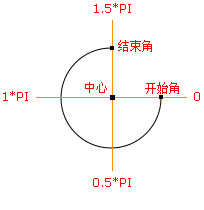
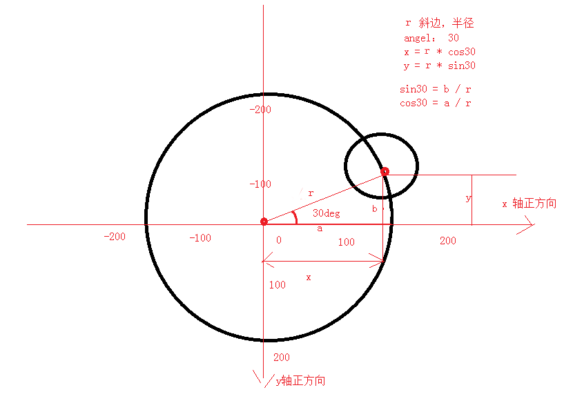
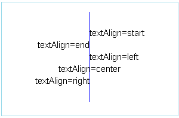
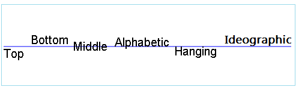
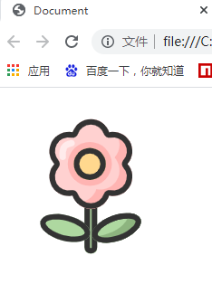

HTML 5 的绘图技术
================

## 1.canvas绘图

canvas元素是HTML5中新添加的一个元素，该元素是HTML5中的一个亮点。Canvas元素就像一块画布，通过该元素自带的API结合JavaScript代码可以绘制各种图形和图像以及动画效果。

### 1.1 浏览器不兼容问题


- ie9以上才支持canvas, 其他chrome、firefox、苹果浏览器等都支持

- 只要浏览器兼容canvas，那么就会支持绝大部分api(个别最新api除外)

- 移动端的兼容情况非常理想，基本上随便使用

- 2d的支持的都非常好，3d（webgl）ie11才支持，其他都支持

- 如果浏览器不兼容，最好进行友好提示，提示内容只有在浏览器不支持时才显示。

  ```html
  <canvas id="cavsElem">
      你的浏览器不支持canvas，请升级浏览器
  </canvas>
  ```


-   浏览器不兼容，也可以使用flash等手段进行优雅降级

### 1.2 创建画布
--------

在页面中创建canvas元素与创建其他元素一样，只需要添加一个\<canvas\>标记即可。该元素默认的**宽高为300\*150**，可以通过元素的width属性和height属性改变默认的宽高。

注意：

-   **不能使用CSS样式**控制canvas元素的**宽高**，否则会导致绘制的图形拉伸。

-   重新设置canvas标签的宽高属性会导致画布擦除所有的内容。

-   可以给canvas画布设置背景色

#### 1.2.1 canvas坐标系


在开始绘制任何图像之前，我们先讲一下canvas的坐标系。canvas坐标系是以左上角0,0处为坐标原点，水平方向为x轴，向右为正；垂直方向为y轴，向下为正。如下图所示：

 

#### 1.2.2 绘制线径

**1.获取上下文对象(CanvasRenderingContext2D)**

首先，获取canvas元素，然后调用元素的getContext(“2d”)方法，该方法返回一个CanvasRenderingContext2D对象，CanvasRenderingContext2D 对象提供了一组用来在画布上绘制的图形函数，使用该对象就可以在画布上绘图了。

```js
var mcanvas  = document.getElementById("mcanvas");
var ctx = mcanvas.getContext("2d");
```

**2.设置绘制起点(moveTo)**

```js
//语法：
ctx.moveTo(x, y); 
```
- 解释：设置上下文绘制路径的起点。相当于移动画笔到某个位置。

-  参数：x,y 都是相对于 canvas坐标系的原点（左上角）。

- 注意：
  绘制线段前必须先设置起点，不然绘制无效。如果不进行设置，就会使用lineTo的坐标当作moveTo

**3.绘制直线(lineTo)**

```js
//语法：
ctx.lineTo(x, y);
```

- 解释：从上一步设置的绘制起点绘制一条直线到(x, y)点。

- 参数：x,y 目标点坐标。

**4.路径的开始和闭合**

```js
//开始路径：
ctx.beginPath();
//闭合路径：
ctx.closePath();
```

解释：如果绘制路径比较复杂，必须使用路径开始和结束。闭合路径会自动把最后的线头和开始的线头连在一起。

**beginPath:**
核心的作用是将不同绘制的形状进行隔离，每次执行此方法，表示重新绘制一个路径，跟之前的绘制的墨迹可以进行分开样式设置和管理。

**closePath:**
如果需要闭合，必须写在stroke()之前，才会起作用。

**绘制图形(stroke)**

```js
//语法：
ctx.stroke();
```

- 解释：根据路径绘制线。路径只是草稿，真正绘制线必须执行stroke

**画笔的颜色和粗细**

在绘制之前，还可以对画笔的颜色和粗细进行设置进行设置，方法如下：

```js
//语法：
ctx.strokeStyle = “#ff0000”;
ctx.lineWidth = 4;  //值为不带单位的数字，并且大于0
```

**填充图形(fill)**

```js
//语法：
ctx.fill();
```

* 解释：对已经画好的图形进行填充颜色。

在填充之前，可以对所填充的颜色进行设置，方法如下：

```js
//语法：
ctx.fileStyle = “#0000ff”;
```

#### canvas绘制的基本步骤：

第一步：获得上下文（笔） =>canvasElem.getContext('2d');

第二步：开始路径规划 =>ctx.beginPath()

第三步：移动起始点 =>ctx.moveTo(x, y)

第四步：绘制线(线条、矩形、圆形、图片...) =>ctx.lineTo(x, y)

第五步：闭合路径 =>ctx.closePath();

第六步：绘制描边 =>ctx.stroke();

案例：通过上面所学的方法绘制一个三角形。

```html
<canvas id="mcanvas">你的浏览器不支持canvas，请升级浏览器</canvas>
<script>		
    var mcanvas  = document.getElementById("mcanvas");	//获得画布
    var mcontext = mcanvas.getContext("2d");	//获得上下文
    mcanvas.width = 900;     //重新设置标签的属性宽高
    mcanvas.height = 600;    //千万不要用 canvas.style.height
    //绘制三角形
    mcontext.beginPath();        //开始路径
    mcontext.moveTo(100,100);    //三角形，左顶点
    mcontext.lineTo(300, 100);   //右顶点
    mcontext.lineTo(300, 300);   //底部的点
    mcontext.closePath();        //结束路径
    mcontext.stroke();           //描边路径
</script>
```

### 1.3 绘制矩形（rectangle）
------------

- **快速创建矩形rect()方法**

  语法：ctx.rect(x, y, width, height);

* 解释：x, y是矩形左上角坐标， width和height都是以像素计

* rect方法只是规划了矩形的路径，并没有填充和描边。

- **创建描边矩形**

  语法：ctx.strokeRect(x, y, width, height);

参数跟rect(x, y, width, height)相同，注意此方法绘制完路径后立即进行stroke绘制,绘制矩形（无填充）。

- **创建填充矩形**

  语法：ctx.fillRect(x, y, width, height);

参数跟rect(x, y, width, height)相同，
此方法执行完成后，立即对当前矩形进行fill填充,绘制"被填充"的矩形。

- **清除矩形（clearReact）**

 语法：ctx.clearRect(x, y, width, hegiht);

 解释：清除某个矩形内的绘制的内容，相当于橡皮擦。

```html
<canvas id="mcanvas">你的浏览器不支持canvas，请升级浏览器</canvas>
<script>
    var mcanvas  = document.getElementById("mcanvas");	//获得画布
    var mcontext = mcanvas.getContext("2d");	//获得上下文
    mcanvas.width = 900;     //重新设置标签的属性宽高
    mcanvas.height = 600;    //千万不要用 canvas.style.height
    //rect方法只是规划了矩形的路径，并没有填充和描边，需要单独描边或填充。
    mcontext.rect(20,20,300,200);
    mcontext.stroke();
    //快速创建一个描边的矩形
    mcontext.strokeRect(400,20,300,200);
    //快速创建一个填充的矩形
    mcontext.fillRect(20,300,300,200);
    //在画布上创建一个矩形区域，该矩形区域中的图形都会被清除
    mcontext.clearRect(120,350,100,100);
</script>
```


### 1.4 绘制圆弧
--------

arc() 方法用于创建弧线（用于创建圆或部分圆）。

语法：ctx.arc(x, y, r, startRadian, endRadian, counterclockwise);

解释：

x,y：圆心坐标。

r：半径大小。

sAngle:绘制开始的弧度。 圆心到最右边点是0度，顺时针方向弧度增大。

eAngel:结束的弧度，注意是弧度，不是角度。

counterclockwise：是否是逆时针，默认是false。true是逆时针，false：顺时针

注意：弧度和角度的转换公式： rad = deg\*Math.PI/180; deg=rad*180/Math.PI

 

### 1.5 绘制圆形和饼图

```html
<canvas id="mcanvas">你的浏览器不支持canvas，请升级浏览器</canvas>
<script>
    var mcanvas  = document.getElementById("mcanvas");	//获得画布
    var mcontext = mcanvas.getContext("2d");	//获得上下文
    mcanvas.width = 900;     
    mcanvas.height = 600;  

    //绘制圆形  
    mcontext.beginPath();
    mcontext.arc(200,200,100,0,360*Math.PI/180);
    mcontext.closePath();
    mcontext.stroke();

    // 通过数据进行绘制饼图
    var data = [{
        "value": .2,
        "color": "red",
        "title": "应届生"
    },{
        "value": .3,
        "color": "blue",
        "title": "社会招生"
    },{
        "value": .4,
        "color": "green",
        "title": "老学员推荐"
    },{
        "value": .1,
        "color": "pink",
        "title": "公开课"
    }];

    var tempAngle = 0;
    var x0 = 600, y0 = 300;
    var raduis = 200;

    for(var i = 0; i < data.length; i++) {
        mcontext.beginPath();
        mcontext.moveTo(x0, y0);
        var angle = data[i].value * 360;
        var startAngle = tempAngle*Math.PI/180;
        var endAngle  = (tempAngle+angle)*Math.PI/180;
        mcontext.fillStyle = data[i].color;
        mcontext.arc(x0, y0, raduis, startAngle, endAngle);
        mcontext.closePath();
        mcontext.fill();
        tempAngle += angle;
    }
</script>
```


三角函数的补充：
```js
Math.sin(弧度); //夹角对面的边和斜边的比值
Math.cos(弧度); //夹角侧边与斜边的比值
```

圆形上面的点的坐标的计算公式
```js
X坐标 =x0 + Math.cos(rad) * r;//x0和y0是圆心点坐标,r是半径
Y坐标 =y0 + Math.sin(rad) * r;//注意都是弧度 
```

 

### 1.6 绘制文字
--------

canvas 提供了两种方法来渲染文本:

```js
fillText(text, x, y [, maxWidth])
```

在指定的(x,y)位置填充指定的文本，绘制的最大宽度是可选的.

```js
strokeText(text, x, y [, maxWidth])
```

在指定的(x,y)位置绘制边框，绘制的最大宽度是可选的.

- 示例1

文本用当前的填充方式被填充：

```js
var ctx = document.getElementById('canvas').getContext('2d');
ctx.font = "48px serif";
ctx.fillText("Hello world", 10, 50);
```

注意：可设置的属性是（按顺序）： "font-style font-weight font-size/line-height font-family"

- 示例2

文本用当前的边框样式被绘制：

```js
var ctx = document.getElementById('canvas').getContext('2d');
ctx.font = "48px serif";
ctx.strokeText("Hello world", 10, 50);
```

**文本样式**

- **font = value**

当前我们用来绘制文本的样式，这个字符串使用和 CSS font 属性相同的语法.
默认的字体是 10px sans-serif。

- **textAlign = value**

文本对齐选项. 可选的值包括：start, end, left, right or center. 默认值是 start。

 

- start：默认值，文本以指定位置起始。

- end：文本以指定位置结束。

- center：整个字符串的中心位置被放置于指定位置。

- left：文本左对齐指定位置。

- right：文本右对齐指定位置。

注意：**direction属性对对齐的实际绘制表现有所影响：**

- **textBaseline = value**

基线对齐选项. 可选的值包括：top, hanging, middle, alphabetic, ideographic,
bottom。默认值是 alphabetic。


 

- top     文本基线在文本块的顶部。

- hanging     文本基线是悬挂基线。 

- middle     文本基线在文本块的中间。 

- alphabetic     文本基线是标准的字母基线。 

- ideographic     文字基线是表意字基线；

- bottom     文本基线在文本块的底部。 与 ideographic 基线的区别在于 ideographic 基线不需要考虑下行字母。

**direction = value**

文本方向。可能的值包括：ltr, rtl, inherit。默认值是 inherit。

direction属性会对textAlign属性会产生影响。

- 如果direction属性设置为ltr，则left和start的效果相同，right和end的效果相同； 

- 如果direction属性设置为rtl，则left和end的效果相同，right和start的效果相同。

代码示例：

```html
<canvas id="mcanvas">你的浏览器不支持canvas，请升级浏览器</canvas>
<script>
    var mcanvas  = document.getElementById("mcanvas");	//获得画布
    var mcontext = mcanvas.getContext("2d");	//获得上下文
    mcanvas.width = 900;     
    mcanvas.height = 600;  

    mcontext.fillStyle = "#0000ff";
    mcontext.font = "italic 30px 微软雅黑";
    mcontext.textAlign = "start";
    mcontext.textBaseline = "top";
    mcontext.fillText("你好", 200, 0, 100);

    mcontext.font = "italic 30px 微软雅黑";
    mcontext.textAlign = "left";
    mcontext.textBaseline = "top";
    mcontext.fillText("你好", 200, 50, 100);

    mcontext.font = "bold 30px 黑体";
    mcontext.textAlign = "center";
    mcontext.textBaseline = "top";
    mcontext.strokeText("你好", 200, 100, 100);

    mcontext.font = "bold 30px 黑体";
    mcontext.textAlign = "right";
    mcontext.textBaseline = "top";
    mcontext.strokeText("你好", 200, 150, 100);

    mcontext.font = "bold 30px 黑体";
    mcontext.textAlign = "end";
    mcontext.textBaseline = "top";
    mcontext.strokeText("你好", 200, 200, 100);
</script>
```

### 1.7 绘制图像
--------

**基本绘制图片的方式**

`context.drawImage(img,x,y);`

参数说明： x,y 绘制图片左上角的坐标， img是绘制图片的dom对象。

 **在画布上绘制图像，并规定图像的宽度和高度**

`context.drawImage(img,x,y,width,height);`

参数说明：width 绘制图片的宽度， height：绘制图片的高度

如果指定宽高，最好成比例，不然图片会被拉伸

设置高 = 原高度 \* 设置宽/ 原宽度;

**图片裁剪，并在画布上定位被裁剪的部分**

`context.drawImage(img,sx,sy,swidth,sheight,x,y,width,height);`

参数说明：

sx,sy 裁剪的左上角坐标，

swidth：裁剪图片的宽度。 sheight:裁剪的高度

其他同上

**用javascript创建img对象**

上面提供的3个方法，都需要一个Image对象作为参数，下面介绍了几种创建Image对象的方式。需要注意的是，为Image的src属性赋值后，Image对象会去装载指定图片，但这种装载是异步的，如果图片太大或则图片来自网络，且网络传输速度慢，Image对象装载图片就会需要：一定的时间开销。为了保证图片装载完成后才去绘制图片，可以监听Image对象的onload回调事件，然后在事件处理函数中绘制图片，如下所示：

第一种方式：

```js
var img = document.getElementById("imgId");
img.onload = function(){  //图片加载完成后，执行此方法
    mcontext.drawImage(img, 10, 10);
}
```


第二种方式：

```js
var img = document.createElement("img");
img.src = "img/a.jpg";
img.alt = "谁笑谁是小狗";
img.onload = function(){  //图片加载完成后，执行此方法
    mcontext.drawImage(img, 10, 10);
}
```


第三种方式：

```js
var img = new Image();//这个就是 img标签的dom对象
img.src = "imgs/arc.gif";
img.alt = "谁笑谁是小狗";
img.onload = function() {  //图片加载完成后，执行此方法
    mcontext.drawImage(img, 10, 10);
}
```

## 2. svg 绘图

SVG 是一种基于 XML 语法的图像格式，全称是可缩放矢量图（Scalable Vector Graphics）。其他图像格式都是基于像素处理的，SVG 则是属于对图像的形状描述，所以它本质上是文本文件，体积较小，放大不失真。

SVG 文件可以直接插入网页，成为 DOM 的一部分，然后用 JavaScript 和 CSS 进行操作。

### 2.1 svg的使用方式

#### 2.1.1 svg代码直接插入网页中

```html
<svg width="200px" height="200px"> 
    <circle cx="100" cy="50" r="40" stroke="black" stroke-width="2" fill="pink"/> 
</svg>
```

其中:
- `<svg>`的width属性和height属性，指定了 SVG 图像在 HTML 元素中所占据的宽度和高度。除了相对单位，也可以采用绝对单位（单位：像素）。如果不指定这两个属性，SVG 图像默认大小是300像素（宽） x 150像素（高）。
- cx 属性定义圆点的 x 坐标
- cy 属性定义圆点的 y 坐标
- r 属性定义半径
- fill：填充色
- stroke：描边色
- stroke-width：边框宽度

### 2.1.2 使用标签引入svg

SVG代码也可以写在一个独立文件中，然后用`、`<embed>`、`<iframe>等标签插入网页

```html

<embed id="embed" src="circle.svg" type="image/svg+xml">
<iframe id="iframe" src="circle.svg"></iframe>
```

### 多学一招

使用字体图标库的svg代码引入

```html
</path>
<path d="M508.3136 535.483733c20.036267 0 36.283733 16.213333 36.283733 36.2496v290.133334a36.283733 36.283733 0 0 1-72.533333 0v-290.133334c0-20.036267 16.247467-36.283733 36.2496-36.283733z m0 31.163734a5.085867 5.085867 0 0 0-4.778667 3.4816l-0.273066 1.604266v290.133334a5.085867 5.085867 0 0 0 9.898666 1.604266l0.238934-1.604266v-290.133334a5.085867 5.085867 0 0 0-5.085867-5.085866z" fill="#333333" p-id="7891">
</path>
```

 

### 2.1.3 CSS中引入svg文件

```css
.main {
    background: url(circle.svg);
}
```

### 2.1.4 常用的标签(了解)

`<line>`标签用来绘制直线。

`<circle>`标签代表圆形。

`<rect>`标签用于绘制矩形。

`<polyline>`标签用于绘制一根折线。

`<path>`标签用于制路径。

<svg width="200px" height="200px"> 
        <circle cx="100" cy="50" r="40" stroke="black" stroke-width="2" fill="pink"/> 
    </svg>
