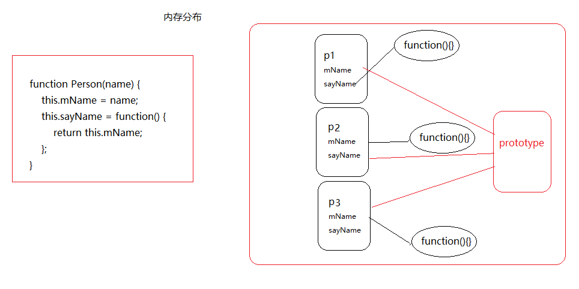
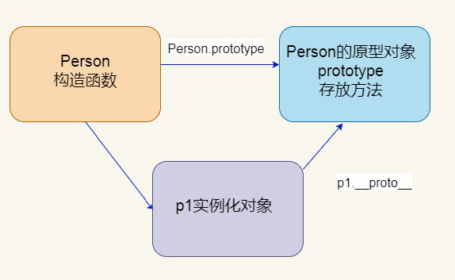

## 1 构造函数

定义：通过 new 函数名, 来实例化对象的函数叫构造函数。任何的函数都可以作为构造函数存在。之所以有构造函数与普通函数之分，主要从功能上进行区别的，构造函数的主要功能为初始化对象，特点是和new 一起使用。new就是在创建对象，从无到有，构造函数就是在为初始化的对象添加属性和方法。**构造函数定义时首字母大写**（规范）。

### 1.1 JS构造函数的实例成员和静态成员

#### 1.1.1 实例成员

　实例成员就是在构造函数内部添加的成员，只能由实例化的对象来访问

```js
function Person(name, age) {
    this.name = name;
    this.age = age;
    this.run = function () {
        console.log(this.name+'在奔跑');
    }
}

var p1 = new Person('张三', 20);  // 创建实例化对象
console.log(p1.name);  // 用实例化对象访问name属性
p1.run();  // 用实例化对象访问run方法
console.log(Person.name);  // 无法访问
```

#### 1.1.2 静态成员

　在构造函数本身上添加的成员，只能由构造函数本身来访问

```js
function Person(name, age) {
    this.name = name;
    this.age = age;
    this.run = function () {
        console.log(this.name+'在奔跑');
    }
}
Person.sex = '男';  // 创建静态成员
var p2 = new Person('李四', 24);  // 创建实例化对象
console.log(Person.sex);  // '男'
console.log(p2.sex);  // undefined
```

### 1.2 构造函数的原型对象 `prototype`

```js
function Person(name) {
    this.mName = name;
    this.sayName = function() {
        return this.mName;
    };
}

var p1 = new Person('张三');
var p2 = new Person('李四');
```

思考:构造函数方法很好用，但是存在浪费内存的问题。

**如何节约内存空间呢?**

 

构造函数通过原型分配的函数是所有对象所共享的。

JavaScript 规定，每一个构造函数都有一个prototype 属性

- prototype是一个对象属性，其属性值为对象，称为原型对象
- 可以通过prototype来添加新的属性和方法，此时所有该构造函数创建的实例对象都会具有这些属性和方法
- 由该构造函数创建的对象会默认链接到该属性上

语法：

- `构造函数.prototype.属性名 = 值;`
- `构造函数.prototype.方法名 = function(){定义方法体};`

我们可以把那些不变的方法，直接定义在 prototype 对象上，这样所有对象的实例就可以**共享**这些方法。

```js
function Person(name) {
    this.mName = name;
    this.sayName = function() {
        return this.mName;
    };
}
Person.prototype.sayName = function() {
    console.log(this.mName);
    return this.mName;
}
var p1 = new Person('张三');
var p2 = new Person('李四');
p1.sayName();
p1.sayName();
```

总结:

- prototype是一个对象属性，其属性值为对象，称为原型对象
- 原型的作用是什么? 共享方法,节约内存

### 1.3 对象原型

每一个对象都会有一个属性 `__proto__` 指向构造函数的 `prototype` 原型对象，之所以实例化对象可以使用构造函数 prototype 原型对象的属性和方法，就是因为对象有 `__proto__` 原型的存在。

>注意谷歌浏览器 `__proto__` 使用 `[[prototype]]` 表示,  360浏览器/IE为: `__proto__`, 火狐: `<prototype>`

`__proto__`对象原型和原型对象 `prototype` 是等价的。

`__proto__`对象原型的意义就在于为对象的查找机制提供一个方向，或者说一条路线，但是它是一个非标准属性，因此实际开发中，不可以使用这个属性，它只是内部指向原型对象prototype。

 

 


### 1.4 constructor 构造函数

对象原型（` __proto__`）和构造函数（prototype）原型对象里面都有一个属性 constructor 属性 ，constructor 我们称为构造函数，因为它指回构造函数本身。
constructor 主要用于记录该对象引用于哪个构造函数，它可以让原型对象重新指向原来的构造函数。

 

### 1.5 原型链

**当访问一个对象的某个属性或方法时，会先在这个对象本身属性上查找，如果没有找到，则会去它的`__proto__`上查找，即它的构造函数的prototype，如果还没有找到就会再在构造函数的prototype的`__proto__`中查找，这样一层一层向上查找就会形成一个链式结构，我们称为原型链。**

简单的回顾一下构造函数、原型和实例的关系：每个构造函数都有一个原型对象，原型对象都包含一个指向构造函数的指针，而实例都包含一个指向原型对象的内部指针。那么假如我们让原型对象等于另一个类型的实例，结果会怎样？显然，此时的原型对象将包含一个指向另一个原型的指针，相应地，另一个原型中也包含着一个指向另一个构造函数的指针。假如另一个原型又是另一个类型的实例，那么上述关系依然成立。如此层层递进，就构成了实例与原型的链条。这就是所谓的原型链的基本概念。

 

### 1.6 构造函数实例和原型对象三角关系

1.构造函数的prototype属性是构造函数原型对象

2.实例对象是由构造函数创建的,实例对象的`__proto__`属性指向了构造函数的原型对象

3.构造函数的原型对象的constructor属性指向了构造函数,实例对象的原型的constructor属性也指向了构造函数

### 1.7 原型链和成员的查找机制

当访问一个对象的属性（包括方法）时，首先查找这个对象自身有没有该属性。

如果没有就查找它的原型（也就是 `__proto__`指向的 prototype 原型对象）。

如果还没有就查找原型对象的原型（Object的原型对象）。

依此类推一直找到 Object 为止（null）。

`__proto__`对象原型的意义就在于为对象成员查找机制提供一个方向，或者说一条路线。

#### 1.7.1 Object.prototype.hasOwnProperty(prop)方法
可以判断一个属性定义在对象本身而不是继承原型链的方法，主要用于判断某个对象中是否有某个属性，返回值为布尔值。

```js
console.log(p1.hasOwnProperty('sayHi'));
console.log(p1.hasOwnProperty('shopping'));
console.log(p1.hasOwnProperty('toString'));
```

#### 1.7.2 Object.prototype.isPrototypeOf(Object)方法

isPrototypeOf 方法接收一个对象，用来判断当前对象是否在传入的参数对象的原型链上，返回一个布尔值。

```js
console.log(Person.prototype.isPrototypeOf(p1));
console.log(Person.prototype.isPrototypeOf(date));
```

### 1.8 原型对象中this指向

构造函数中的`this`和原型对象的`this`,都指向我们`new`出来的实例对象

```js
function Person(name) {
    this.mName = name;
};
var that;
Person.prototype.sayName = function() {
    console.log('我是大咖');
    that = this;
}
var p1 = new Person('张三');
// 1. 在构造函数中,里面this指向的是实例对象
p1.sayName();
console.log(that);
console.log(p1);
console.log(that === p1); //true
// 2.原型对象函数里面的this指向的是实例对象
```

### 1.9 通过原型为数组扩展内置方法

```js
Array.prototype.sum = function() {
    var sum = 0;
    for (var i = 0; i < this.length; i++) {
        sum += this[i];
    }
    return sum;
};
 //此时数组对象中已经存在sum()方法了  可以始终 数组.sum()进行数据的求
```

