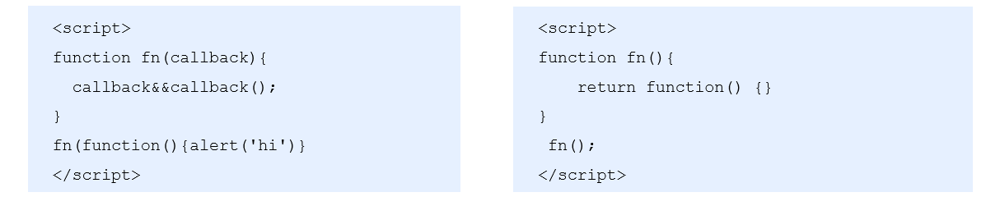

## 1 严格模式

### 1.1 什么是严格模式

JavaScript 除了提供正常模式外，还提供了严格模式（strict mode）。ES5 的严格模式是采用具有限制性 JavaScript变体的一种方式，即在严格的条件下运行 JS 代码。

严格模式在 IE10 以上版本的浏览器中才会被支持，旧版本浏览器中会被忽略。

严格模式对正常的 JavaScript 语义做了一些更改： 

1.消除了 Javascript 语法的一些不合理、不严谨之处，减少了一些怪异行为。

2.消除代码运行的一些不安全之处，保证代码运行的安全。

3.提高编译器效率，增加运行速度。

4.禁用了在 ECMAScript 的未来版本中可能会定义的一些语法，为未来新版本的 Javascript 做好铺垫。比如一些保留字如：class,enum,export, extends, import, super 不能做变量名

### 1.2 开启严格模式

严格模式可以应用到整个脚本或个别函数中。因此在使用时，我们可以将严格模式分为为脚本开启严格模式和为函数开启严格模式两种情况。

- 情况一 :为脚本开启严格模式

  - 有的 script 脚本是严格模式，有的 script 脚本是正常模式，这样不利于文件合并，所以可以将整个脚本文件放在一个立即执行的匿名函数之中。这样独立创建一个作用域而不影响其他script 脚本文件。
    
    ```js
    <script>
      　"use strict"; //当前script标签开启了严格模式
    </script>
    <script>
      			//当前script标签未开启严格模式
    </script>
    ```
  
- 情况二: 为函数开启严格模式

  - 要给某个函数开启严格模式，需要把“use strict”;  (或 'use strict'; ) 声明放在函数体所有语句之前。

    ```js
    function fn(){
    　　"use strict";
    　　return "123";
    } 
    //当前fn函数开启了严格模式
    ```

### 1.3 严格模式中的变化

严格模式对 Javascript 的语法和行为，都做了一些改变。

```js
'use strict'
num = 10 
console.log(num)//严格模式后使用未声明的变量
    --------------------------------------------------------------------------------
var num2 = 1;
delete num2;//严格模式不允许删除变量
--------------------------------------------------------------------------------
function fn() {
    console.log(this); // 严格模式下全局作用域中函数中的 this 是 undefined
}
fn();  
---------------------------------------------------------------------------------
function Person() {
    this.sex = '男';
}
// Person();严格模式下,如果 构造函数不加new调用, this 指向的是undefined 如果给他赋值则 会报错.
var p1 = new Person();
console.log(p1.sex);
----------------------------------------------------------------------------------
setTimeout(function() {
    console.log(this); //严格模式下，定时器 this 还是指向 window
}, 2000);  
----------------------------------------------------------------------------------
// 严格模式下，函数里的参数不允许重名
function fun1(num, num) {
    console.log(num + num);
};
fun1(2, 3);
```

[更多严格模式要求参考](https://developer.mozilla.org/zh-CN/docs/Web/JavaScript/Reference/Strict_mode)

## 2 高阶函数

高阶函数是对其他函数进行操作的函数，它接收函数作为参数或将函数作为返回值输出。符合以下条件其一：

- 参数是函数
- 函数作为返回值



此时fn 就是一个高阶函数

函数也是一种数据类型，同样可以作为参数，传递给另外一个参数使用。最典型的就是作为回调函数。

同理函数也可以作为返回值传递回来。

## 3 闭包

### 3.1 变量的作用域

变量根据作用域的不同分为两种：全局变量和局部变量。

1. 函数内部可以使用全局变量。

2. 函数外部不可以使用局部变量。

3. 当函数执行完毕，本作用域内的局部变量会销毁。

**注意：函数内部可以直接读取全局变量，但是在函数外部无法读取函数内部的局部变量。**

**思考:如何从外部读取函数内部的局部变量？**

出于种种原因，我们有时候需要获取到函数内部的局部变量。但是，上面已经说过了，正常情况下，这是办不到的！只有通过变通的方法才能实现，那就是在函数内部，再定义一个函数。

### 3.2 什么是闭包

函数和对其周围状态（**lexical environment，词法环境**）的引用捆绑在一起构成**闭包**（**closure**）。也就是说，闭包可以让你从内部函数访问外部函数作用域。

### 3.3 闭包的作用

作用：延伸变量的作用范围。

```js
function fn() {
    var num = 10;
    function fun() {
        console.log(num);
    }
    return fun;
}
var f = fn();
f();
f();
```

总结：       
- 闭包有三个特性：
1. 函数嵌套函数
2. 函数内部访问外部函数的参数或变量
3. 可以使函数中的变量可以长期驻扎在内存
- 使用闭包的好处
1.使函数内部变量长期驻扎在内存中
2.避免全局变量的污染（多人定义同样名字的全部变量冲突）
- 使用闭包的坏处：
内存泄漏(应用程序不再用到的内存，由于某些原因，没有及时释放，就叫做内存泄漏。)

### 3.4 闭包的案例

1. 利用闭包的方式得到当前li 的索引号

```js
for (var i = 0; i < lis.length; i++) {
// 利用for循环创建了4个立即执行函数
// 立即执行函数也成为小闭包因为立即执行函数里面的任何一个函数都可以使用它的i这变量
(function(i) {
    lis[i].onclick = function() {
      console.log(i);
    }
 })(i);
}
```

## 4 递归

### 4.1 什么是递归

**递归：**如果一个函数在内部可以调用其本身，那么这个函数就是递归函数。简单理解:函数内部自己调用自己, 这个函数就是递归函数

**注意：**递归函数的作用和循环效果一样，由于递归很容易发生“栈溢出”错误（stack overflow），所以必须要加退出条件return。

### 4.2 递归求1~n的阶乘

```js
//利用递归函数求1~n的阶乘 1 * 2 * 3 * 4 * ..n
function fn(n) {
    if (n == 1) { //结束条件
        return 1;
    }
    return n * fn(n - 1);
}
console.log(fn(3));
```

## 5 Object.assign()与深拷贝浅拷贝

### 5.1 Object.assign() 实现浅拷贝

浅拷贝

- 拷贝出来的目标对象的地址和源对象的地址的内存空间是同一块空间

- 让几个对象共用一个内存

Object.assign()方法用于将所有可枚举属性的值从一个或多个源对象分配到目标对象。它将返回目标对象。

```js
Object.assign(target, ...sources)
```

参数: target:目标对象。sources:源对象。

返回值:返回目标对象。

### 5.2 深拷贝

- 克隆出一个对象，数据相同

- 但是引用地址不同

#### 5.2.1 递归深复制对象

```js
// 封装函数 
function deepCopy(newobj, oldobj) {
    for (var k in oldobj) {
        // 判断我们的属性值属于那种数据类型
        // 1. 获取属性值  oldobj[k]
        var item = oldobj[k];
        // 2. 判断这个值是否是数组
        if (item instanceof Array) {
            newobj[k] = [];
            deepCopy(newobj[k], item)
        } else if (item instanceof Object) {
            // 3. 判断这个值是否是对象
            newobj[k] = {};
            deepCopy(newobj[k], item)
        } else {
            // 4. 属于简单数据类型
            newobj[k] = item;
        }
    }
};
```

#### 5.2.2 使用`JSON`方法

**`JSON.parse(JSON.stringify(obj))`**

[JSON.parse()实现深拷贝的弊端](https://www.cnblogs.com/goloving/p/6951206.html)

