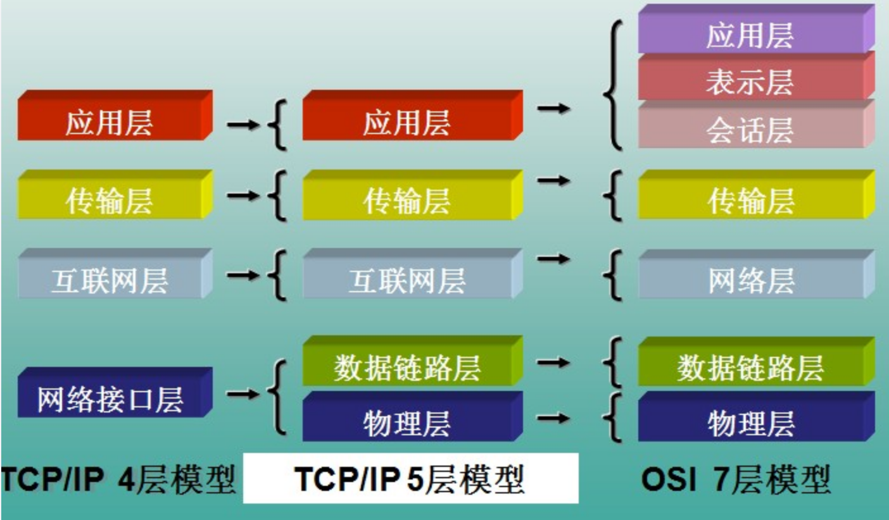
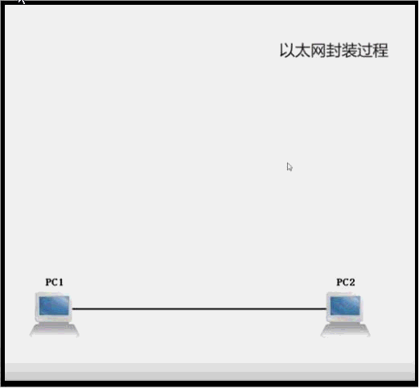
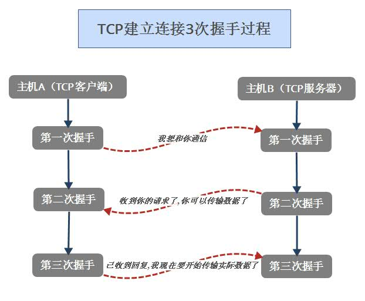
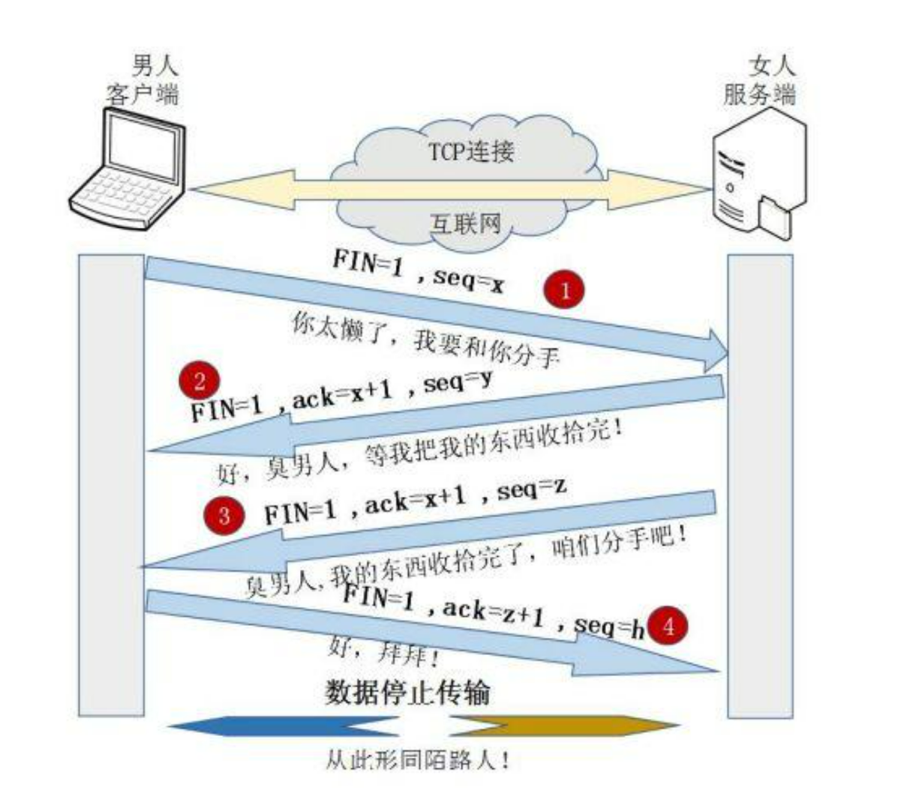
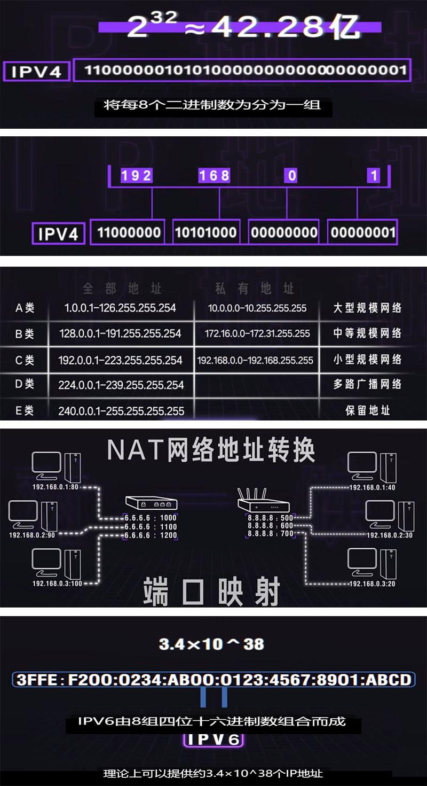
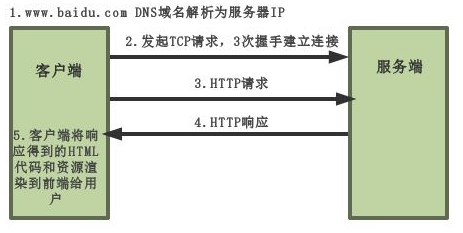
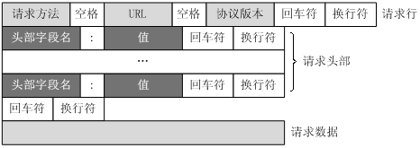

# 1 计算机网络
计算机网络是指将地理位置不同的具有独立功能的多台计算机及其外部设备，通过通信线路连接起来，在网络操作系统，网络管理软件及网络通信协议的管理和协调下，实现资源共享和信息传递的计算机系统。

思考:计算机网络之间以何种规则进行通信，就是网络模型研究问题？

## 1.1 网络参考模型 

网络模型一般是指

[OSI](https://baike.so.com/doc/5399194-5636680.html)(Open System Interconnection)开放系统互连参考模型

[TCP/IP](https://baike.baidu.com/item/TCP%2FIP%E5%8D%8F%E8%AE%AE/212915?fromtitle=tcp%2Fip&fromid=214077&fr=aladdin)(Transmission Control Protocol/Internet Protocol)传输控制协议/网际协议参考模型

 

 

【1】应用层： 主要是一些终端的应用，比如说FTP（各种文件下载），WEB（http,https），QQ之类的（可以把它理解成我们在电脑屏幕上可以看到的东西．就是终端应用）。

【2】表示层：主要是进行对接收的数据进行解释、加密与解密、压缩与解压缩等,另外表示层协定来保证不同的计算机可以彼此理解。

【3】会话层：会话层主要功能是管理和协调不同主机上各种进程之间的通信，即负责建立、管理和终止应用程序之间的会话。

【4】传输层：定义了一些传输数据的协议和端口号（WWW端口80等），如：TCP,UDP,常常把这一层数据叫做`段`。

【5】网络层：在位于不同地理位置的网络中的两个主机系统之间提供连接和路径选择，而网络层正是管理这种连接的层。在这一层工作的设备是`路由器`，常把这一层的数据叫做数据包。 

【6】数据链路层：主要将从物理层接收的数据进行MAC地址（网卡的地址）的封装与解封装。常把这一层的数据叫做帧。在这一层工作的设备是`交换机`，数据通过交换机来传输。 

【7】物理层：主要定义物理设备标准，如网线的接口类型、光纤的接口类型、各种传输介质等。它的主要作用是传输比特流（就是由1、0转化为电流强弱来进行传输)，这一层的数据叫做`比特`。

 

 

## 1.2 各层重要对应的协议

**应用层**

DNS (Domain Name System）域名解析协议

FTP（File Transfer Protocol）文件传输协议

HTTP（Hypertext Transfer Protocol）超文本传输协议 HTTPS 

SSL（Secure Sockets Layer）安全套接字层协议

**传输层**

TCP（Transmission Control Protocol）传输控制协议

UDP (User Datagram Protocol）用户数据报协议

**网络层**: IP(Internet Protocol) 网际互连协议 ,路由器(IPv4 · IPv6)

**数据链路层**: 以太网 ,Mac地址,交换机

**物理层**

**光导纤维** 同轴电缆 双绞线

| OSI七层网络模型         | TCP/IP四层概念模型 | 对应网络协议     |
| ----------------------- | ------------------ | ---------------- |
| 应用层（Application）   | 应用层             | DNS,FTP,HTTP,SSL |
| 表示层（Presentation）  |                    |                  |
| 会话层（Session）       |                    |                  |
| 传输层（Transport）     | 传输层             | TCP, UDP         |
| 网络层（Network）       | 网络层             | IP               |
| 数据链路层（Data Link） |                    |                  |
| 物理层（Physical）      | 网络层到物理层     |                  |

## 1.3 DNS解析（域名解析服务器）

1. 首先会搜索浏览器自身的DNS缓存（缓存时间比较短，大概只有1分钟，且只能容纳1000条缓存）

2. 如果浏览器自身的缓存里面没有找到，那么浏览器会搜索系统自身的DNS缓存

3. 如果还没有找到，那么尝试从 hosts文件里面去找(C:\WINDOWS\system32\drivers\etc)

4. 在前面三个过程都没获取到的情况下，就递归地去域名服务器去查找.

## 1.4 FTP（文件传输协议）

FTP允许用户以文件操作的方式（如文件的增、删、改、查、传送等）与另一主机相互通信。 可用FTP程序访问远程资源， 实现用户往返传输文件、目录管理等等。

## 1.5 UDP（用户数据报协议）

用户数据报协议（UDP，User Datagram Protocol）,将数据源和目的封装成数据包中，不需要建立连接；因无连接，是不可靠协议；不需要建立连接，速度快。 

## 1.6 TCP(传输控制协议)
建立连接，形成传输数据的通道；在连接中进行大数据量传输；通过三次握手完成连接，是可靠协议；必须建立连接，效率会稍低

**"三次握手"的详解**

为什么需要三次握手?为了防止已失效的连接请求报文段突然又传送到了服务端，因而产生错误。


 


**"四次挥手"的详解**

所谓的四次挥手即TCP连接的释放(解除)。连接的释放必须是一方主动释放，另一方被动释放。以下为客户端主动发起释放连接的图解：

  

 


## 1.7 IP(网际互连协议)

ip地址:网络上的每台计算机和其它设备都规定了一个唯一的地址IP地址。

局域网->广域网->IP地址(IPV4)->NAT网络地址转换->IP地址(IPV6)

 


 ## 1.8 网络通信三要素

- 传输协议

  通讯的规则
  常见协议：TCP/IP，UDP

- IP地址: 

  InetAddress，网络中计算机的唯一标识，不易记忆，可用主机名。

- 端口号
  用于标识进程的逻辑地址，不同进程的标识，netstat -ano  

  

举例：我想和主席说话

1.我要找到主席（ip）

2.对他说话，对耳朵说（端口号）；

3.我说：I love the motherland但是听不懂。我只能用汉语说。说我爱我的祖国（协议）


**URL:** 

协议://主机:端口号/abs_path


# 2. HTTP协议(重点)

## 2.1 HTTP
### 2.1.1 HTTP简介

超文本传输协议（Hyper Text Transfer Protocol,HTTP）规定客户端如何从服务器端获取文档和向服务器端提交表单内容，以及服务器端如何响应这些请求和提交。

HTTP是一个基于TCP/IP通信协议来传递数据的协议，传输的数据类型为HTML 文件,图片文件, 查询结果等。

HTTP协议一般用于B/S(Brower/Server)架构（浏览器和服务器架构模式）。浏览器作为HTTP客户端通过URL向HTTP服务端即WEB服务器发送所有请求。

 

### 2.1.2 什么是HTTPS?

为了解决上述HTTP存在的问题，就用到了HTTPS。

HTTPS 协议（HyperText Transfer Protocol over Secure Socket Layer）：一般理解为HTTP+SSL/TLS，通过 SSL证书来验证服务器的身份，并为浏览器和服务器之间的通信进行加密。

**那么SSL又是什么？**

SSL（Secure Socket Layer，安全套接字层）：1994年为 Netscape 所研发，SSL 协议位于 TCP/IP 协议与各种应用层协议之间，为数据通讯提供安全支持。

TLS（Transport Layer Security，传输层安全）：其前身是 SSL，它最初的几个版本（SSL 1.0、SSL 2.0、SSL 3.0）由网景公司开发，1999年从 3.1 开始被 IETF 标准化并改名，发展至今已经有 TLS 1.0、TLS 1.1、TLS 1.2 三个版本。SSL3.0和TLS1.0由于存在安全漏洞，已经很少被使用到。TLS 1.3 改动会比较大，目前还在草案阶段，目前使用最广泛的是TLS 1.1、TLS 1.2。

**连接过程**

1. 首先客户端通过URL访问服务器建立SSL连接。
2. 服务端收到客户端请求后，会将网站支持的证书信息（证书中包含公钥）传送一份给客户端。
3. 客户端的服务器开始协商SSL连接的安全等级，也就是信息加密的等级。
4. 客户端的浏览器根据双方同意的安全等级，建立会话密钥，然后利用网站的公钥将会话密钥加密，并传送给网站。
5. 服务器利用自己的私钥解密出会话密钥。
6. 服务器利用会话密钥加密与客户端之间的通信。


### 2.1.3 http协议和https协议的区别

https协议,https（Secure Hypertext Transfer Protocol）安全超文本传输协议 ，由SSL安全证书+HTTP协议构建的可进行加密传输、身份认证的网络协议要比http协议安全 。

    

传输信息安全性不同、连接方式不同、端口不同、证书申请方式不同

**一、传输信息安全性不同** 软件抓包

1、http协议：是超文本传输协议，信息是明文传输。如果攻击者截取了Web浏览器和网站服务器之间的传输报文，就可以直接读懂其中的信息。

2、https协议：是具有安全性的ssl加密传输协议，为浏览器和服务器之间的通信加密，确保数据传输的安全。

**二、连接方式不同**

1、http协议：http的连接很简单，是无状态的。

2、https协议：是由SSL＋HTTP协议构建的可进行加密传输、身份认证的网络协议。

**三、端口不同**

1、http协议：使用的端口是80。

2、https协议：使用的端口是443．

**四、证书申请方式不同**

1、http协议：免费申请。

2、https协议：需要到cat申请证书，一般免费证书很少，需要交费。

## 2.2 URL

统一资源**标识**符（Uniform Resource Identifier，**URI**）

统一资源**定位**符（Uniform Resource Locator,**URL**）是互联网上用来标识某一处资源的地址。以下面这个URL为例，介绍下普通URL的各部分组成：

```nginx
http://www.hg-zn.com:8080/news/index.html?boardID=5&ID=24618&page=1#name
```

从上面的URL可以看出，一个完整的URL包括以下几部分：

1. 协议部分：该URL的协议部分为"http："，这代表网页使用的是HTTP协议。在Internet中可以使用多种协议，如HTTP，FTP等本例中使用的是HTTP协议。在"HTTP"后面的"//"为分隔符。
2. 域名部分：该URL的域名部分为"www.hg-zn.com"。一个URL中，也可以使用IP地址作为域名使用。
3. 端口部分：跟在域名后面的是端口，域名和端口之间使用":"作为分隔符。端口不是一个URL必须的部分，如果省略端口部分，将采用默认端口80，8080端口是被用于WWW代理服务的，可以实现网页浏览，经常在访问某个网站或使用代理服务器的时候，会加上":8080"端口号。另外Apache Tomcat web server安装后，默认的服务端口就是8080.
4. 虚拟目录部分：从域名后的第一个"/"开始到最后一个"/"为止，是虚拟目录部分。虚拟目录也不是一个URL必须的部分。本例中的虚拟目录是"/news/"
5. 文件名部分：从域名后的最后一个"/"开始到"？"为止，是文件名部分，如果没有"?",则是从域名后的最后一个"/"开始到"\#"为止，是文件部分，如果没有"？"和"\#"，那么从域名后的最后一个"/"开始到结束，都是文件名部分。本例中的文件名是"index.asp"。文件名部分也不是一个URL必须的部分，如果省略该部分，则使用默认的文件名。
6. 参数部分：从"？"开始到"\#"为止之间的部分为参数部分，又称搜索部分、查询部分。本例中的参数部分为"username=lisi&password=24618&page=1"。参数可以允许有多个参数，参数与参数之间用"&"作为分隔符。
7. 锚部分：从"\#"开始到最后，都是锚部分,#是用来指导浏览器动作的，#后面的字符串，都会被浏览器解析为位置标识符。本例中的锚部分是"name"。锚部分也不是一个URL必须的部分。


## 2.3 HTTP请求和响应

HTTP协议定义Web客户端如何从Web服务器请求Web页面，以及服务器如何把Web页面传送给客户端。HTTP协议采用了请求/响应模型。客户端向服务器发送一个请求报文，请求报文包含请求的方法、URL、协议版本、请求头部和请求数据。服务器以一个状态行作为响应，响应的内容包括协议的版本、成功或者错误代码、服务器信息、响应头部和响应数据。

以下是 HTTP 请求/响应的步骤：

**1、客户端连接到Web服务器**

**2、发送HTTP请求**

**3、服务器接受请求并返回HTTP响应**

**4、释放TCP连接**

**5、客户端浏览器解析HTML内容,显示浏览器上**

### 总结:在浏览器地址栏键入URL，按下回车之后会经历以下流程：(必会)

1. 例如对`www.baidu.com`这个网址进行DNS域名解析，得到对应的IP地址。

2. 根据这个IP，找到对应的服务器，发起TCP的三次握手。

3. 建立TCP连接后发起HTTP请求。

4. 服务器响应HTTP请求，浏览器得到html代码。

5. 浏览器解析html代码，并请求html代码中的资源（如js、css、图片等）（先得到html代码，才能去找这些资源）。

6. 浏览器对页面进行渲染呈现给用户。

7. 服务器完毕,关闭TCP连接,四次挥手。

2.4 请求消息Request
---------------

客户端发送给服务器端的HTTP请求消息由**请求行（requestline）**、**请求头部（header）**、**空行**和**请求数据(请求体|正文)**四个部分组成，如下图所示。

 

```html
GET /index.html HTTP/1.1(请求行)
Host: www.baidu.com 
Connection: keep-alive 
Upgrade-Insecure-Requests: 1 
User-Agent: Mozilla/5.0 (Windows NT 10.0; WOW64) AppleWebKit/537.36 (KHTML, like Gecko) Chrome/67.0.3396.99 Safari/537.36 
Accept:text/html,application/xhtml+xml,application/xml;q=0.9,image/webp,image/apng,*/*;q=0.8 
Accept-Encoding: gzip, deflate, br 
Accept-Language: zh-CN,zh;q=0.9 
Cookie:BAIDUID=002E605A2EE0AA27D0B7C2295B9D0242:FG=1;BIDUPSID=002E605A2EE0AA27D0B7C2295B9D0242;PSTM=1532306024;BD_UPN=12314753;BDORZ=B490B5EBF6F3CD402E515D22BCDA1598;delPer=0;BD_HOME=0;H_PS_PSSID=1465_26911_21121_26350_26925_20719
```

**第一部分：请求行，用来说明请求类型，要访问的资源以及所使用的HTTP版本.**

请求行以一个方法符号开头，以空格分开，后面跟着请求的URI和协议的版本。GET指定请求类型为GET，/index.html为要访问的资源，该行的最后一部分说明使用的是HTTP1.1版本。

**第二部分：请求头部，紧接着请求行（即第一行）之后的部分，用来说明服务器要使用的附加信息。**

从第二行起为请求头部，HOST将指出请求的目的地。User-Agent，服务器端和客户端脚本都能访问它,它是浏览器类型检测逻辑的重要基础.该信息由你的浏览器来定义,并且在每个请求中自动发送等等。

**第三部分：空行，请求头部后面的空行是必须要有的**

即使第四部分的请求数据为空，也必须有空行。

**第四部分：请求数据也叫主体，可以添加任意的其他数据。**

这个例子的请求数据为空。

POST请求例子，使用Charles抓取的request：

```html
POST /api/students HTTP/1.1 
Host: 192.168.0.130:3000 
Connection: keep-alive 
Content-Length: 245 
Cache-Control: max-age=0 
Origin: http://192.168.0.130:3000 
Upgrade-Insecure-Requests: 1 
Content-Type: application/x-www-form-urlencoded 
User-Agent: Mozilla/5.0 (Windows NT 10.0; WOW64) AppleWebKit/537.36 (KHTML, like Gecko) Chrome/67.0.3396.99 Safari/537.36 
Accept:text/html,application/xhtml+xml,application/xml;q=0.9,image/webp,image/apng,*/*;q=0.8 
Referer: http://192.168.0.130:3000/students/create 
Accept-Encoding: gzip, deflate 
Accept-Language: zh-CN,zh;q=0.9

clazz=%E7%81%AB%E8%8A%B112%E6%9C%9F&name=%E9%99%88%E6%A2%A6%E9%BE%99&gender=%E7%94%B7&age=20&hobby=%E7%9D%A1%E8%A7%89&hobby=%E6%89%93%E8%B1%86%E8%B1%86&tel=13834569928&address=%E5%8D%97%E9%98%B3&remark=%E6%96%B0%E5%90%8C%E5%AD%A6   --------》（请求数据）
```

第一部分：请求行，第一行明了是post请求，以及http1.1版本。  

第二部分：请求头部，第二行至第六行。  

第三部分：空行，第七行的空行。  

第四部分：请求数据，第八行。

2.5 响应消息Response
----------------

一般情况下，服务器接收到请求后，会对请求进行处理，然会返回给客户端一个HTTP的响应消息。

HTTP响应也由四个部分组成，分别是：**状态行(响应行)、响应头、空行和响应正文(响应体)**。

```html
HTTP/1.1 200 OK 
Bdpagetype: 1 
Bdqid: 0xc347763400004282 
Cache-Control: private 
Connection: Keep-Alive 
Content-Encoding: gzip 
Content-Type: text/html 
Cxy_all: baidu+5e802392ce41b42ad2771898f1006759 
Date: Thu, 09 Aug 2018 01:36:14 GMT 
Expires: Thu, 09 Aug 2018 01:36:06 GMT 
Server: BWS/1.1 
Set-Cookie: delPer=0; expires=Sat, 01-Aug-2048 01:36:06 GMT 
Set-Cookie: BDSVRTM=0; path=/ 
Set-Cookie: BD_HOME=0; path=/ 
Set-Cookie: H_PS_PSSID=1465_26964_21121_26350_26925_20719;path=/;domain=.baidu.com Strict-Transport-Security: max-age=172800 
Vary: Accept-Encoding 
X-Ua-Compatible: IE=Edge,chrome=1 
Transfer-Encoding: chunked

<!DOCTYPE html>
<html lang="en">
<head>
    <meta charset="UTF-8" />
    <title>百度一下</title>
</head>
<body>
   文档内容。。。
</body>
</html>
```


 

**第一部分：状态行，由HTTP协议版本号， 状态码， 状态消息 三部分组成。** 

第一行为状态行，（HTTP/1.1）表明HTTP版本为1.1版本，状态码为200，状态消息为（ok）

**第二部分：消息报头，用来说明客户端要使用的一些附加信息**

第二行和第三行为消息报头，Date:生成响应的日期和时间；Content-Type:指定了MIME类型的HTML(text/html),编码类型是UTF-8

**第三部分：空行，消息报头后面的空行是必须的**

**第四部分：响应正文，服务器返回给客户端的文本信息。**

空行后面的html部分为响应正文。文件(附件)

2.6 HTTP状态码
----------

HTTP状态码由三个十进制数字组成，第一个十进制数字定义了状态码的类型，后两个数字没有分类的作用。HTTP状态码共分为5种类型：

| 分类 | 分类描述                                       |
| ---- | ---------------------------------------------- |
| 1**  | 信息，服务器收到请求，需要请求者继续执行操作   |
| 2**  | 成功，操作被成功接收并处理                     |
| 3**  | 重定向，需要进一步的操作以完成请求             |
| 4**  | 客户端错误，请求包含语法错误或无法完成请求     |
| 5**  | 服务器错误，服务器在处理请求的过程中发生了错误 |

常见状态码：

- 200 OK //客户端请求成功
- 301 永久重定向
- 302 临时重定向，这里注意一个细节。
  但是多数浏览器实际实现的时候并没有遵循这一条，所以才在http1.1中引入了303和307两个状态码。302为了兼容老版本也保留了下来
- 304
  304的含义不是重定向。
  304表示用户查找的资源存在，但是不满足请求需要的条件。
  一般出现304的情况，请求首部中包含if-xxx这样的条件请求，当判断条件为假的时候就会返回304。
- 400 Bad Request //客户端请求有语法错误，不能被服务器所理解
- 401 Unauthorized//请求未经授权，这个状态代码必须和WWW-Authenticate报头域一起使用
- 403 Forbidden //服务器收到请求，但是拒绝提供服务
- 404 Not Found //请求资源不存在，eg：输入了错误的URL
- 405 状态码为表示请求的方式不对
- 500 Internal Server Error //服务器上代码发生不可预期的错误
- 503 Server Unavailable //服务器当前不能处理客户端的请求

2.7 HTTP请求方法
------------

根据HTTP标准，HTTP请求可以使用多种请求方法,一种9种。

HTTP1.0定义了三种请求方法：GET, POST 和 HEAD方法。一次只能发送一个请求

HTTP1.1新增了五种请求方法：OPTIONS, PUT, DELETE, TRACE  CONNECT和PATCH方法。 一次可以发送n个请求

我们最常用的请求方法为GET和POST。

2.8 GET和POST请求的区别
-------------------

| 类型         | GET方法                                                      | POST方法                          |
| ------------ | ------------------------------------------------------------ | --------------------------------- |
| 数组传输方式 | 通过URL传输数据(地址栏拼接)                                  | 通过请求体传输                    |
| 数据安全     | 数据在URL中,可通过浏览器,及历史记录,缓存等很容易查到数据信息 | 数据在请求体内,有一定的安全性保证 |
| 数据类型     | 只允许ASCII字符 长度4k                                       | 无限制                            |
| GET无害      | 刷新,后退等服务端没有影响(安全)                              | 可能会引起重复提交表单(非安全)    |


# 3. JSON XML

数据交换格式: 

1. XML(可扩展标记语言) 早起
2. JSON(JavaScript Object Notation, JS 对象简谱) **字符串**

3.1 JSON是什么？
------------

- JSON：(JavaScript Object Notation, JS 对象简谱) 是一种轻量级的数据交换格式。它基于ECMAScript (欧洲计算机协会制定的js规范)的一个子集，采用完全独立于编程语言的文本格式来存储和表示数据。简洁和清晰的层次结构使得 JSON 成为理想的数据交换语言。 易于人阅读和编写，同时也易于机器解析和生成，并有效地提升网络传输效率。

- JSON是一种轻量型的数据交换格式。

- 早期客户端与服务器端使用xml的格式传输数据：  **XML(可扩展标记语言)**被设计用来传输和存储数据,XML 的设计宗旨是*传输数据*，而非显示数据。

```xml
<students>
    <student>
        <name>张三</name>
        <age>20</age>
        <gender>女</gender>
        <address>郑州</address>
    </student>
    <student>
        <name>李四</name>
        <age>21</age>
        <gender>男</gender>
        <address>焦作</address>
    </student>
    ...
</students>
```


后来又出现了一种更简洁、轻量型的数据交换格式：

```json
[
    {
        "name": "张小好",
        "age": 18,
        "gender": "女",
        "address": "郑州"
    },
    {
        "name": "张小谷",
        "age": 18,
        "gender": "男",
        "address": "郑州"
    }
    ...
]
```

**注意:**XML不是XHTML

XHTML：XHTML 是更严谨更纯净的 HTML 版本。

1.功能上

（1）HTML对于各大浏览器兼容性较差(pc端浏览器、手机端浏览器、PAD)，对于网页页面编写技巧要求比较高，现在web前端开发的静态网页，一般都是HTML5。

（2）XHTML可以很好处理各大浏览器的兼容，XHTML的语法较为严谨，习惯松散结构的HTML编写者刚开始接触XHTML有些不习惯。XHTML结合了部分XML的强大功能及大多数HTML的简单特性。

2.书写习惯上

- XHTML 元素必须被正确地嵌套。
- XHTML 元素必须被关闭。
- 标签名必须用小写字母。
- XHTML 文档必须拥有根元素。


3.2 JSON格式的语法
--------------

- Object，对象以左大括号（{）开始，以右大括号结束，对象中是一系列的name/value对，name和value以冒号（:）分隔，每一对name/value之间以逗号（,）分隔。如下图所示：

- Array，数组以左中括号（[）开始，以右中括号（]）结束，数组中是一系列有序的value值，value值之间以逗号（,）分隔。

- Value可以是字符串，数字，布尔值，null，或者是对象和数组。如下图所示：

3.3 JSON对象的方法
--------------

JSON.parse(str)

作用：将JSON格式的字符串解析成一个JavaScript的对象（Object或Array）。

JSON.stringify(obj)

作用：将JavaScript对象解析成JSON格式的字符串。
