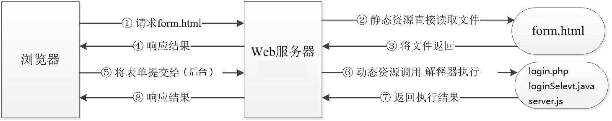
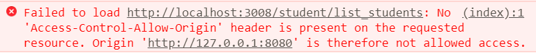

# 1. 表单提交案例



Node

# 2. Ajax

Ajax是Asynchronous Javascript And XML（异步JavaScript和XML）的缩写。

Ajax技术描述了使用脚本操纵HTTP和Web服务器进行数据交换，在页面不刷新的情况下，实现页面的局部更新。是指一种创建交互式网页应用的网页开发技术。

注意：

- Ajax = 异步 （JavaScript) 和 XML）。

- Ajax 是一种用于创建快速动态网页的技术。

- Ajax 是一种在无需重新加载整个网页的情况下，能够更新部分网页的技术。

- 通过在后台与服务器进行少量数据交换，Ajax 可以使网页实现异步更新。这意味着可以在不重新加载整个网页的情况下，对网页的某部分进行更新。

- 传统的网页（不使用 Ajax）如果需要更新内容，必须重载整个网页页面。

   


2.1 创建XMLHttpRequest对象
----------------------

浏览器在XMLHttpRequest类上定义了它的HTTP方法。这个类型的每个实例都表示一个独立的请求/响应对，并且这个对象的属性和方法允许指定请求细节和获取相应数据。

创建XMLHttpRequest对象：

```js
var xhr = new XMLHttpRequest();
```

回忆：

一个HTTP请求由4部分组成：

-   HTTP请求方法(GET/POST等)

-   请求的URL

-   一个可选的请求头集合，其中可能包含身份验证信息

-   一个可选的请求主体

2.2 Ajax向服务器发送请求
--------

创建XMLHttpRequest对象之后，我们就可以使用XMLHttpRequest对象的open()方法发起请求，该方法必须要指定请求方法（GET、POST等）和URL。

```js
xhr.open('GET', 'home.html');
xhr.open('method', 'URL' [, asyncFlag [, 'userName' [, 'password']]])
```

- method：用于指定请求方式，如GET、POST，不区分大小写。
  URL：表示请求的地址。
  asyncFlag：可选参数，用于指定请求方式，同步请求为false，默认为异步请求true。
  userName和password：可选参数，表示HTTP认证的用户名和密码。

- 请求方法不区分大小写，但通常都写成大写的形式。除了‘GET’和‘POST’之外，该方法还支持‘DELETE’、‘HEAD’、‘OPTIONS’和‘PUT’作为第一个参数。但‘TRACE’和 ‘CONNECT’由于安全风险已被明确禁止使用。

- URL用来指定请求的资源。它可以是一个相对URL（相对于当前文档的URL），也可以是一个绝对URL。如果使用的是绝对URL，则协议、主机和端口通常必须要与当前文档URL保持一致，因为跨域的请求通常会报错（在服务器允许跨域请求时，则不会报错）。


注意：

**同步和异步的区别**：是否阻塞代码的执行。

异步方式（默认）：是非阻塞的，浏览器端的JavaScript程序不用等待Web服务器响应，可以继续处理其他事情。当服务器响应后，再来处理Ajax对象获取到的响应结果。下面请看异步的执行过程，

 

同步方式：是阻塞的，当Ajax对象向Web服务器发送请求后，会等待Web服务器响应的数据接收完成，再继续执行后面的代码。

 

2.3 设置http请求头
----------

除了设置请求方法和URL以外，我们还可以设置请求头。POST请求一般是要用‘Content-Type’请求头指定请求主体的MIME类型(用来描述实体内容的编码格式)：

```js
xhr.setRequestHeader('Content-Type', 'application/x-www-form-urlencoded');//默认编码格式(数据被编码为名称/值对) 表单提交
xhr.setRequestHeader('Content-Type', 'application/json');//用来告诉服务端消息主体是序列化后的 JSON 字符串
```

2.4 发送请求
--------

使用XMLHttpRequest发起请求的最后一步是指定可选的请求主体并将它发送给服务器。

```js
xhr.send(content);//Open的方式是post
xhr.send(null);//open的方式是get的一般不用send
xhr.send('clazz=火花&name=小谷&gender=男');
xhr.send(JSON.stringify(js对象));
```


GET请求没有请求体，所以应该传递null或省略这个参数。而POST请求通常具有请求主体，同时它应该与使用setRequestHeader()指定的‘Content-Type’一致。

## 2.5 获得响应

一个完整的HTTP响应消息由状态行、响应头、空行和响应主体组成。这些都可以通过XMLHttpRequest对象的方法和方法获取。

 

2.6 监听请求状态的改变
------------------

为了在响应准备就绪时得到通知，必须监听XMLHttpRequest对象上的onreadystatechange事件。

```js
xhr.onreadystatechange = function(){

};
```


但为了理解这个事件类型，我需要先弄明白readyState属性。readyState属性的值是一个整数，用来指示HTTP请求的状态。readyState属性的值如下表所示：

| **常量**         | **值** | **含义**                                                 |
| ---------------- | ------ | -------------------------------------------------------- |
| UNSENT           | 0      | 初始化，尚未调用open()方法                               |
| OPENED           | 1      | 启动，已调用open()方法，但尚未调用send()方法             |
| HEADERS_RECEIVED | 2      | 发送，已调用send()方法，接收到响应头信息                 |
| LOADING          | 3      | 接收，已经接收到部分响应主体                             |
| DONE             | 4      | 完成，已经接收到全部响应数据，而且已经可以在客户端使用了 |

理论上，每次readyState属性的值改变都会触发readystatechange事件。然而，在实际应用中，当readyState属性的值改变为0或1时可能不会触发这个事件。在某些浏览器中LOADING状态可能会触发多次。当readyState属性的值改变为4或服务器的响应完成时，所有的浏览器都会触发readystatechange事件。因此为了判断响应是否真正完成了，我们应该在事件处理程序中时刻检测readyState属性的值。

```js
xhr.onreadystatechange = function(){
    if (xhr.readyState === 4) {
        console.log(‘请求完成了’);
    }
};
```


但这样只能确保请求完成了，并不能确保请求成功。因此我们还需要根据响应的【**状态码**】来判断请求是否成功。

我们可以通过XMLHttpRequest对象的status和statusText属性获取HTTP状态码，状态消息。

```js
xhr.status       // 200
xhr.statusText   // OK
```

代码如下：

```js
xhr.onreadystatechange = function(){
    if (xhr.readyState === 4 && xhr.status === 200) {
        console.log(‘请求完成并且成功了’);
    }
};
```

完善的判断信息

```js
xhr.onreadystatechange = function(){
    if (xhr.readyState === 4) {
        if ((xhr.status >= 200 && xhr.status < 300) || xhr.status == 304){
            alert(xhr.responseText);
        } else {
            alert("Request was unsuccessful: " + xhr.status);
        };
    };
};
```


 

2.7 获取响应头
----------

- 响应头用于告知客户端本次响应的基本信息，包括服务器程序名、内容的编码格式、缓存控制等。请求头和响应头是浏览器和服务器之间交互的重要信息，由程序自动处理，通常不需要人为干预。

- 使用getResponeHeader()和getAllResponeHeaders()获取响应头信息。XMLHttpRequest会自动处理cookie：它会从getAllResponeHeaders()返回的响应头中过滤掉cookie头，而如果给getResponseHeader()传递‘Set-Cookie’和‘Set-Cookie2’则返回null。

```js
xhr.getResponseHeader('Content-Type')      // ‘text/html’
xhr.getAllResponseHeaders()                 // 获取所有的响应头
```

2.8 获得响应主体
------------

服务器的响应实体内容有多重编码格式，当用户请求的是一个网页，实体内容的格式就是HTML，如果请求的是图片响应的就是图片，服务器为了告知浏览器内容类型，会通过响应头中的Content-type字段来描述，这是一种MIME常见的类型。

无论响应主体内容类型是什么，响应主体的内容都会保存到responseText和responseXML属性中；而对于非XML数据而言responseXML属性的值将为null。

```js
xhr.response 
xhr.responseText     // 服务器端返回的文本内容
```

注意点：如果是json格式xhr.response和xhr.responseText都可以，如果是二进制数据那么使用xhr.response 接受


2.9 处理服务器返回的数据
--------------------

服务器返回的数据都是JSON格式的字符串，为了使用方便，我们需要先把字符串转换成JavaScript对象（Object/Array）。

```js
JSON.parse(xhr.responseText);// JSON对象或者JSON数组  转换为  JS对象或JS数组
```

转换之后，就能以访问对象属性的方式拿到各种数据，实例如下：

```json
// 转换成Object类型的对象
{"id":"0001""name":"zhangsan","age":25,"gender":true,"phone":"12342344533"}

// 转换成Array类型的对象
[
    {"id":"0001""name":"zhangsan","age":25,"gender":true,"phone":"12342344533"},
    {"id":"0001""name":"zhangsan","age":25,"gender":true,"phone":"12342344533"},
    {"id":"0001""name":"zhangsan","age":25,"gender":true,"phone":"12342344533"},
    {"id":"0001""name":"zhangsan","age":25,"gender":true,"phone":"12342344533"}
]
```


2.10 怎样向服务器传递数据？
----------------------

**GET方式的请求：**

传递给后台的数据要拼接到URL的后面，以问号（？）开始，参数是以name=value的形式出现，每两个键值对之间以（&）分隔。例如：

```js
'http://192.168.0.101:8080/AjaxDemo/LoginServlet?username=zhangsan&password=123456' 
```

**POST方式的请求：**

先通过请求头（Content-Type）指定数据的格式类型，常用的格式类型有两种，分别是：

- application/x-www-form-urlencoded：用来告诉服务端消息主体是经过
  URL编码的字符串(窗体数据被编码为名称/值对)

- application/json ：用来告诉服务端消息主体是序列化后的 JSON 格式的字符串

- ```js
  xhr.setRequestHeader("Content-Type","application/x-www-form-urlencoded");
  xhr.setRequestHeader("Content-Type","application/json");
  ```

然后将编码之后的数据通过send()方法传递给服务器，例如：

xhr.send(“clazz=%E7%81%AB%E8%8A%B112%E6%9C%9F&name=%E9%99%88%E6%A2%A6%E9%BE%99&gender=%E7%94%B7&age=20&hobby=%E7%9D%A1%E8%A7%89&hobby=%E6%89%93%E8%B1%86%E8%B1%86&tel=13834569928&address=%E5%8D%97%E9%98%B3&remark=%E6%96%B0%E5%90%8C%E5%AD%A6&date=2019-08-01”)。

# 3. 接口文档

在实际的项目开发中，后台服务写好之后，后台人员会给前台人员一份【**接口文档**】，文档中列出了每个功能所需要的接口信息，我们前台人员只需要根据文档的要求与服务器进行数据交互即可。接口文档示例如下：

| **接口**  | **请求方式** | **作用**     | **请求参数**    |
| ------------ | ------------ | ------------------- | ---------------- |
| /api/student/login | GET | 跳转 | uname |
| /api/student/getStudent    | GET          | 1、获取所有学生信息 2、根据ID获取学生信息 3、根据name获取学生信息 | **可选参数： id 学生ID name 学生姓名**                       |
| /api/student/removeStudent | POST      | 1、根据ID删除学生信息                                        | **必传参数： id 学生ID**                                     |
| /api/student/addStudent    | POST         | 1、添加学生信息                                              | **必传参数： clazz班级 name 姓名  gender 性别 age 年龄 tel 电话 hobby 爱好 address 地址信息 remark 备注信息** |
| /api/student/updateStudent | POST         | 1、更新学生信息                                              | **必传参数：id 学生ID  clazz 班级 name 姓名  gender 性别 age 年龄 tel 电话 hobby 爱好 address 地址信息 remark 备注信息** |

# 4. 开发模式

## 4.1 前后端混合

前端代码与后台代码混合编写，也就是说前端代码和后台代码同时出现在一个文件中。例如，index.php文件是由PHP代码和HTML代码混写的：

```jsp
<!DOCTYPE html>
<html>
<body>
<?php
$x=5; // global scope
function myTest() {
   $y=10; // local scope
   echo "<p>在函数内部测试变量：</p>";
   echo "变量 x 是：$x";
   echo "<br>";
   echo "变量 y 是：$y";
} 

myTest();

echo "<p>在函数之外测试变量：</p>";
echo "变量 x 是：$x";
echo "<br>";
echo "变量 y 是：$y";
?>
</body>
</html>

//再例如，index.jsp是由 Java代码和HTML代码混写的：

<%@ page language="java" contentType="text/html; charset=UTF-8"
    pageEncoding="UTF-8"%>
<html>
<head>
<title>life.jsp</title>
</head>
<body>

<%! 
  private int initVar=0;
  private int serviceVar=0;
  private int destroyVar=0;
%>
<%!
  public void jspInit(){
    initVar++;
    System.out.println("jspInit(): JSP被初始化了"+initVar+"次");
  }
  public void jspDestroy(){
    destroyVar++;
    System.out.println("jspDestroy(): JSP被销毁了"+destroyVar+"次");
  }
%>
<%
  serviceVar++;
  System.out.println("_jspService(): JSP共响应了"+serviceVar+"次请求");

  String content1="初始化次数 : "+initVar;
  String content2="响应客户请求次数 : "+serviceVar;
  String content3="销毁次数 : "+destroyVar;
%>
<h1>菜鸟教程 JSP 测试实例</h1>
<p><%=content1 %></p>
<p><%=content2 %></p>
<p><%=content3 %></p>
```

传统的web应用开发中，大多数的工作人员会将浏览器作为前后端的分界线。将浏览器中为用户进行页面展示的部分称之为前端，而将运行在服务器，为前端提供业务逻辑和数据准备的所有代码统称为后端。

在前后端不分离的时代，在项目开发阶段，前端人员负责编写HTML页，后端人员负责写接口，前端人员调试页面动态数据都需要后端人员的配合，不能单独调试，耗时耗力。前端把前后端代码存放于同一个代码库中，甚至是同一工程目录下。页面中还夹杂着后端代码。前后端工程师进行开发时，都必须把整个项目导入到开发工具中。

 

## 4.2 前后端分离

随着时代的发展，渐渐的许多大中小公司开始把前后端的界限分的越来越明确，前端工程师只管前端的事情，后端工程师只管后端的事情。

 

- 前后端分离情形一 :前端资源和后台接口位于同一个服务器

 

- 前后端分离情形二

前台资源和后台接口分别位于不同的服务器(跨域)

 

## 4.3 同源策略

**同源策略**，它是由Netscape提出的一个著名的安全策略。现在所有支持JavaScript的浏览器都会使用这个策略。

所谓同源是指，域名，协议，端口相同。

当一个浏览器的两个tab页中分别打开来。百度和谷歌的页面，浏览器的百度tab页执行一个脚本的时候会检查这个脚本是属于哪个页面的，即检查是否同源，只有和同源的脚本才会被执行。

如果非同源，那么在请求数据时，浏览器会在控制台中报一个异常，提示拒绝访问。

例如【前后端分离情形二】就属于没有遵循同源策略的情况，浏览器不允许一个服务器中的页面向另一个服务器发送请求，错误信息如下：

 

- <font color="red">跨域</font> : JavaScript出于安全方面的考虑，不允许跨域调用其他页面的对象。那什么是跨域呢，简单地理解就是因为JavaScript同源策略的限制，a.com域名下的js无法操作b.com或是c.a.com域名下的对象。 **当协议、子域名、主域名、端口号中任意一个不相同时，都算作不同域**。不同域之间相互请求资源，就算作“跨域”。

  例如：<http://www.abc.com/index.html> 请求 <http://www.efg.com/service.php>。 

我们通常称这种类型的请求叫**跨域请求**。那怎么样解决这个问题呢？

1、通过设置后台服务器允许跨域请求

2、JSONP

3、使用代理服务器(nginx)

4、前台使用代理

## 4.4 JSONP实现跨域请求

Jsonp(JSON with Padding) 是我们可以通过使用 html的script标记来进行跨域请求，并在响应中返回要执行的script代码，其中可以直接使用JSON传递javascript对象。这种跨域的通讯方式称为JSONP。

 

注意：JSONP本质上是加载了其他网站的脚本，这种方式存在安全风险，因为其他网站可以利用JavaScript窃取用户信息，或更改页面内容。因此，在加载脚本前，一定确保对方是受信任的网站。

