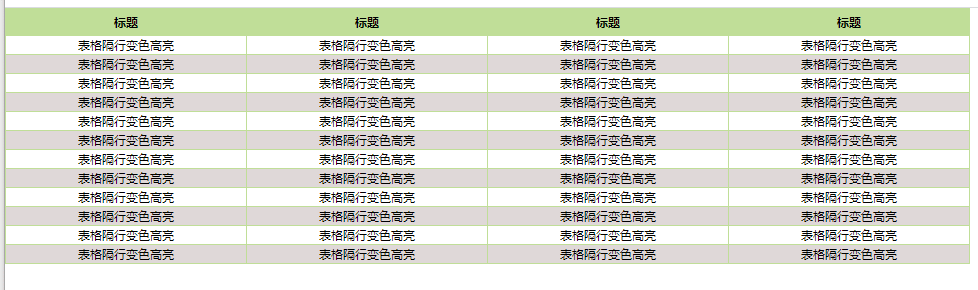
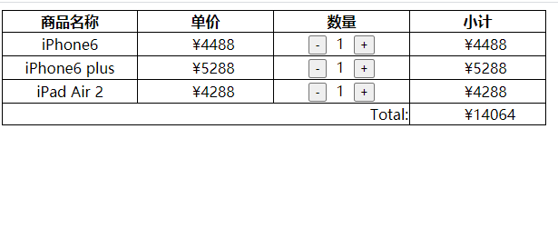

### 1. 隔行变色加高亮显示

- 题目描述

   表单显示数据，隔行变色：

   1）所有展示数据隔行变色，颜色自定义。

   2）鼠标进入后高亮显示，移开后恢复。
   
   

###    2. 突出显示

- 题目描述

  突出显示案例，具体表现如下图：

  

- 提示

  1.鼠标进入li，所有li，透明度设置为1，当前的为0.4

  2.移开后，所有li，透明度全部设置为1.

  3.mouseenter()、mouseleave()没有冒泡

###    3.切换盒子背景色

- 题目描述

  切换类名方式操作改变盒子的背景色。

  

- 提示:

  切换类名的方法
### 4.简易购物车金额变化

提示:

1.根据元素关系找到集合然后设置金额的变化(元素的文本的变化)

