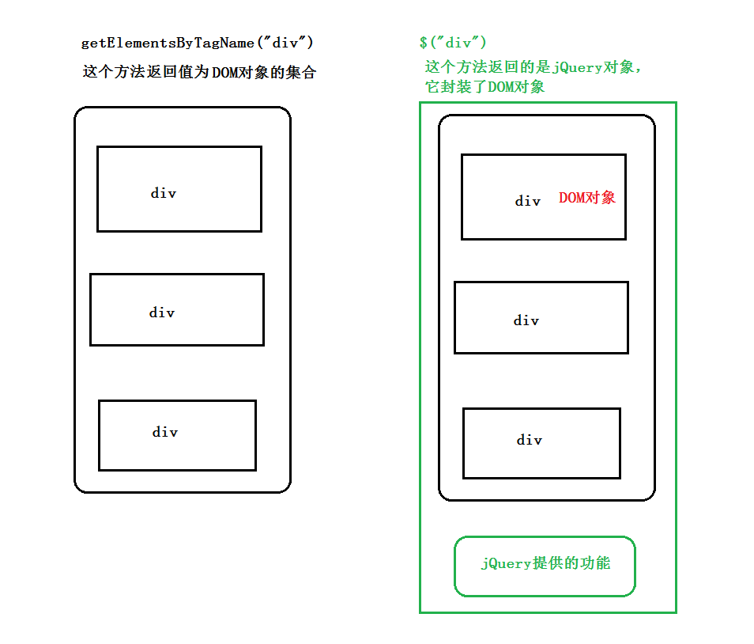
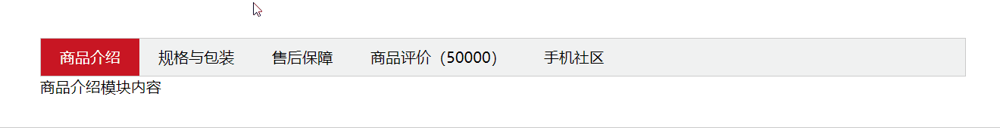

# 1、jQuery简介

jQuery是一个快速，小型且功能丰富的JavaScript库。借助易于使用的API（可在多种浏览器中使用），使HTML文档的遍历和操作，事件处理，动画和Ajax等事情变得更加简单。兼具多功能性和可扩展性，jQuery改变了数百万人编写JavaScript的方式。

兼容多浏览器的javascript函数库，把我们常用的一些功能进行了封装，方便我们来调用，提高我们的开发效率。核心理念是写得更少，做得更多（write less,do more）。

## 1.1 发展历史

+ 2006年约翰.莱西格设计的1.x
+ 2013年jquery团队推出了2.x版本，2.x版本放弃了对IE6,7,8的支持。
+ 2014年jQuery团队推出了3.x版本，3.x版本分成了连个分支：jQuery 3.0和jQuery 3.0 compat

# 2、使用jQuery

## 2.1 下载jQuery

选择时的另外一个疑虑是应该选择压缩版本还是选择未压缩版本。压缩版本主要用在产品阶段，而未压缩版本则用在测试和开发阶段，如下图所示。

官方地址：[jQuery](<https://jquery.com/>)

## 2.2 使用CDN（Content Delivery Network）改善性能

 

CDN全称：Content Delivery Network，即内容分发网络。如今使用CDN服务器来改进网站性能已经是普遍的做法，


尽可能避开互联网上有可能影响数据传输速度和稳定性的瓶颈和环节，使内容传输的更快、更稳定。通过在网络各处放置节点服务器所构成的在现有的互联网基础之上的一层智能虚拟网络，CDN系统能够实时地根据网络流量和各节点的连接、负载状况以及到用户的距离和响应时间等综合信息将用户的请求重新导向离用户最近的服务节点上。

目的：解决因分布、带宽、服务器性能带来的访问延迟问题，适用于站点加速、点播、直播等场景。使用户可就近取得所需内容，解决 Internet网络拥挤的状况，提高用户访问网站的响应速度和成功率。

使用CDN并不能保证万无一失。没有哪个服务器或网络是一年365天在线的，:scream:CDN也不例外。当CDN服务器不可用时，如果用户浏览器没有缓存过 jQuery 文件，那么网站代码可能就会停止工作。

**可用的CDN服务器如下：**

jQuery官方提供的CDN：https://code.jquery.com/jquery-3.4.1.js

新浪：http://lib.sinaapp.com/

## 2.3 引入方式

```html
<!DOCTYPE html>
<html>
<head>
<title> Using jQuery </title>
</head>
<body>
<p>I'm a paragraph</p>

<!-- 从百度的CDN获取jQuery -->
<script src="http://apps.bdimg.com/libs/jquery/2.1.4/jquery.min.js"></script>

<!-- 如果CDN不可用，到自己的服务获取jQuery -->
<script>window.jQuery || document.write('<script src="./js/jquery.min.js"><\/script>');</script>
</body>
</html>
```

# 3. jQuery的入口函数

## 3.1 书写方式

```javascript
/*方式1 */
$(document).ready(function() {

});

//等价于上面的代码

/*方式2 */
$(function() {

});
```

## 3.2 ready方法和onload方法的区别

$(document).ready()和window.onload在表面上看都是页面加载时我们就去执行一个函数或动作，但是在具体的细节上$(document) ready()和window onload还是有区别的。

**覆盖问题（或使用次数）**
    
原生的入口函数只能使用一次，否则后者会把前者覆盖掉

```javascript
window.onload = function(){
    console.log('onload1');
};

window.onload = function(){
    console.log('onload2');
};
```

jQuery的入口函数可以多次使用，不存在覆盖问题

```javascript
$(function(){
    console.log('ready1');
});

$(function(){
    console.log('ready2');
});
```

**执行的时机不同**

	window.onload必须等到页面内包括图片的所有元素加载完毕后才能执行。  　　

下面的DOM元素都有关联的资源文件：

```html

<script src="./jquery/jquery-1.11.3.min.js"></script>
<link rel="stylesheet" href="./css/mystyle.css">
```

$(document).ready()是DOM结构绘制完毕后就执行，不必等到加载完毕。

```javascript    
$(function(){
    console.log('ready1');
});

window.onload = function(){
    console.log('onload1');
};
```

举一个例子，有一个大型的图库网站，为网页中所有图片添加某些行为，例如单击图片后让它隐藏或显示。如果使用window.onload方法来处理，那么用户必须等到每一幅图片都加载完毕后，才可以进行操作。如果使用jQuery中的$(document).ready()方法来进行设置，只要DOM就绪时就可以操作了，不需要等待所有图片下载完毕。很显然，把网页解析为DOM树的速度比把网页中的所有关联文件加载完毕的速度快很多。

# 4. 选择器

当我们想要操所页面中的元素时，首先要做的就是选取元素。选取页面中元素可以使用jQuery给我们提供的`$()`方法，该方法需要提供选择器作为参数，方法执行完成后会返回给我们一个**jQuery对象**，被选取的元素就包含在该对象中。

## 4.1 基础选择器(重点)

选择器     |示例         |说明
-----------|-------------|---------------------------------------
全局选择器 |`$('*')     `|选择所有元素
标签选择器 |`$('p')     `|选择所有的`p`元素
ID选择器   |`$('#top')  `|选择所有`id`属性值为`top`的元素
Class选择  |`$('.box')  `|选择所有`class`属性值中包含`box`类名的元素

- 注意: 隐式迭代:就是自动把匹配的所有元素内部进行遍历循环，给每一个元素添加方法.

## 4.2 按层次结构查找元素（匹配选择器）(重点)

通过样式名称来查找元素确实很方便，但是我们通常不需要查询整个页面来查找元素。有时可能只需要查找某个元素的子元素。

选择器    |示例          |说明
----------|--------------|---------------------------------------
多重选择器 |`$('div, p')` |选择所有的`div`元素和`p`元素(相当于css的并集选择器)
子代选择器|`$('div > p')`|选择作为`div`元素子元素的所有`p`元素
后代选择器|`$('div p')`|选择作为`div`后代的所有`p`元素
相邻选择器（同级兄弟）|`$('div + p')`|选择紧邻`div`元素且位于其后的`p`元素
兄弟选择器|`$('div ~ p')`|选择作为`div`元素且位于其后的所有`p`元素

## 4.3 使用属性选择元素

选择器              |示例            |说明
--------------------|----------------|----------------------
`tag[attr]         `|`$('p[class]')`|选择所有带有`class`属性的`p`元素
`tag[attr="value"] `|`$('p[class="top"]')`|选择所有`class`属性值恰好等于`top`的`p`元素
`tag[attr!="value"]`|`$('p[class!="top"]')`|选择所有`class`属性值不等于`top`的`p`元素
`tag[attr1="value"][attr2="value"]`|`$('p[class="top"][id="con"]')`|选择所有`class`属性值恰好等于`top`(并且)带有`id`的属性值为con的`p`元素


# 5. 选择过滤器

## 5.1 位置过滤选择器(重点)

| 选择器   | 描述                                                         |
| -------- | :----------------------------------------------------------- |
| `:first` | 选择上下文匹配的第一个元素。`p:first`返回所有p元素中的第一个p标签 |
| `:last ` | 选择上下文匹配的最后一个元素。`p:last返回所有p元素中的最后一个p标签` |
| `:even ` | 选择上下文中的偶数元素。p:even`选择匹配元素集合中的偶数位的p元素`（从0开始） |
| `:odd  ` | 选择上下文中的奇数元素。p:odd`选择匹配元素集合中的奇数位的p元素`（从0开始） |
| `:eq(n)` | 选择第n个匹配元素（从0开始）                                 |
| `:gt(n)` | 大于，选择第n个匹配元素之后的元素（排除第n个）               |
| `:lt(n)` | 小于，选择第n个匹配元素之前的元素（排除第n个）               |

## 5.2 子元素过滤选择器

| 选择器                               | 描述                                    |
| :----------------------------------- | :-------------------------------------- |
| `:first-child                      ` | 匹配上下文中第一个子元素                |
| `:last-child                       ` | 匹配上下文中最后一个子元素              |
| `:first-of-type                    ` | 匹配上下文中特定类型的第一个子元素      |
| `:last-of-type                     ` | 匹配上下文中特定类型的最后一个子元素    |
| `:nth-child(n|even|odd|Xn+Y)  `      | 匹配从前往后计数的第n个子元素           |
| `:nth-of-type(n|even|odd|Xn+Y)   `   | 匹配从前往后计数的第n个特定类型的子元素 |

## 5.4 选取表单元素过滤器

jQuery提供了一些专门为表单设计的选择器，用于快速访问表单元素。

| 选择器      | 描述                                                         |
| ----------- | ------------------------------------------------------------ |
| `:checked ` | 选择处于选中状态的复选框、单选框或下拉框元素（`checkbox`，`radio`，`option`） |
| `:disabled` | 选择处于禁用状态的元素（`button, input, optgroup, option, select, textarea`） |
| `:selected` | 选择处于被选中状态的`option`元素                             |


## 5.3 内容过滤器

选择器          |示例                       |说明
----------------|---------------------------|----------------------
`:contains(text)`|`$('div:contains("hello")')`|选择匹配元素集合中包含指定文本的所有`div`元素(匹配包含给定文本的元素)
`:empty        `|`$('div:empty')           `|选择所有没有子元素的`div`元素（包括文本节点）
`:parent       `|`$('div:parent')          `|选择所有非空的`div`元素（匹配含有子元素或者文本的元素）
`:has(selector)`|`$(div:has(p)')          `|选择所有包含`p`元素的`div`元素(匹配含有选择器所匹配的元素的元素)
`:not(selector) `|`$('a:not(.active)') `|选择不匹配`.active`选择器的`a`元素

# 7. jQuery 对象和 DOM 对象

使用 jQuery 方法和原生JS获取的元素是不一样的，总结如下 : 

1. 用原生 JS 获取来的对象就是 DOM 对象
2. jQuery 方法获取的元素就是 jQuery 对象。
3. jQuery 对象本质是： 利用$对DOM 对象包装后产生的对象（伪数组形式存储）。

> 注意：
>
> 只有 jQuery 对象才能使用 jQuery 方法，DOM 对象则使用原生的 JavaScirpt 方法。



## 7.1  jQuery 对象和 DOM 对象转换

	DOM 对象与 jQuery 对象之间是可以相互转换的。因为原生js 比 jQuery 更大，原生的一些属性和方法 jQuery没有给我们封装. 要想使用这些属性和方法需要把jQuery对象转换为DOM对象才能使用。

```javascript
// 1.DOM对象转换成jQuery对象，方法只有一种
var box = document.getElementById('box');  // 获取DOM对象
var jQueryObject = $(box);  // 把DOM对象转换为 jQuery 对象

// 2.jQuery 对象转换为 DOM 对象有两种方法：
//   2.1 jQuery对象[索引值]
var domObject1 = $('div')[0]

//   2.2 jQuery对象.get(索引值)
var domObject2 = $('div').get(0)
 
```

总结：实际开发比较常用的是把DOM对象转换为jQuery对象，这样能够调用功能更加强大的jQuery中的方法。

# 8. 操作jQuery集合

## 8.1 确定集合大小

jQuery集合与数组很相似，我们可以像获取数组中元素的个数一样，通过`length`属性获取jQuery集合中元素的个数。例如，我们可以获取页面中所有`<p>`元素的，然后输出jQuery集合中`<p>`元素

```javascript
alert($('p').length);
```

## 8.2 遍历集合元素

| 方法                                      | 描述                 |
| ----------------------------------------- | -------------------- |
| $(selector).each(function(index,element)) | 遍历集合中的所有元素 |

## 8.3 获取元素的索引(重点)

| 方法             | 描述                                                         |
| ---------------- | ------------------------------------------------------------ |
| index([element]) | 指定元素相对于其他指定元素的 index 位置，从0开始计数。,如果未找到元素，index() 将返回 -1。 |

## 8.4 集合转数组

| 方法      | 描述                                   |
| --------- | -------------------------------------- |
| toArray() | 将jQuery集合转换成包含所有元素的数组。 |

## 8.5 过滤(方法)

| 方法                | 描述                                                         |
| ------------------- | ------------------------------------------------------------ |
| get([index])        | 返回集合中指定索引的元素。如果不指定索引，则返回所有的元素。 |
| first()             | 返回包含第一个元素的新集合。如果初始集合为空，则返回空集合。 |
| last()              | 返回包含最后一个元素的新集合。如果初始集合为空，则返回空集合。 |
| eq(index)           | 返回包含指定索引元素的新集合。参数可以为负数，表示从集合结尾开始计算。 |
| filter(selector)    | 创建一个集合副本，然后从新集合中删除不符合selector选择器条件的元素。 |
| has(selector)       | 创建并返回新的集合，只包含匹配selector选择器的子元素。       |
| not(selector)       | 创建不包含选择器selector参数匹配元素的新集合。               |
| is(selector)        | 确定集合中是否有元素匹配给定的选择器。返回时true,或者false   |
| slice(start, [end]) | 获取集合的子集。--还有splice方法等                           |
| map(callback)       | 在集合中的每个元素上调callback函数，然后返回值到一个jQuery对象中。 |

#### 多学一招：

- prevObject

jQuery选择器在遍历的过程中都会找到一组元素（一个jQuery对象），然后jQuery会把这组元素推入到栈中。prevObject属性就指向这个对象栈中的前一个对象，而通过这个属性可以回溯到最初的DOM元素集。利用这个DOM元素栈可以减少重复的查询和遍历的操作，而减少重复操作也正是优化jQuery代码性能的关键所在。

## 8.6 创建新HTML元素
使用jQuery动态创建元素是非常容易的，只需要给`$()`函数传递一个包含HTML标签的字符串就可以创建一个jQuery对象。

```javascript
$('<div>Hello jQuery</div>');
```

如果只是想创建一个空的`<div>`元素，那么可以直接使用下面的简写代码：

```javascript
$('<div></div>');
```

这种语法等价于下面的两种语法：

```javascript
$('<div>');
$('<div/>');
```

假如要创建一个``元素，它包含多个属性，并且可以点击该图片，我们可以下面的语法创建：

```javascript
$('', {
    src: 'img/photo.png',
    alt: '',
    title: '',
    click: function() {
        alert('nihao');
    }
}).appendTo('body');
```

这段代码创建一个包含多个属性，并且可以点击的``元素，然后将该元素追加到了页面上的`<body>`元素中。

## 8.7 根据关系获取集合(重点)


| 方法                                  | 描述                                                         |
| ------------------------------------- | ------------------------------------------------------------ |
| (*selector*).parent(*filter*)         | 返回元素的直接父元素。如果设置选择器，则只会返回匹配选择器的父元素。*filter*可选，规定缩小搜索父元素范围的选择器表达式。 |
| (*selector*).parents(*filter*)        | 返回元素的祖先元素。如果设置选择器，则只会返回匹配选择器的祖先元素。*filter*可选，规定缩小搜索祖先元素范围的选择器表达式。 |
| (*selector*).children(*filter*)       | 取得一个包含匹配的元素集合中每一个元素的所有子元素的元素集合。如果设置选择器，则只会返回匹配选择器的子元素。<br />*filter*可选。规定缩小搜索子元素范围的选择器表达式。 |
| (*selector*).find(*filter*)(重点)     | 返回元素中匹配选择器的后代元素。<br /><font color='red'>*filter*必需</font>。过滤搜索后代条件的选择器表达式、元素或 jQuery 对象。 |
| (*selector*).prev(*filter*)           | 返回元素前面的直接兄弟元素。                                 |
| (*selector*).prevAll(*filter*)        | 返回元素前面的所有兄弟元素。                                 |
| (*selector*).next(*filter*)           | 返回元素后面的直接兄弟元素。                                 |
| (*selector*).nextAll(*filter*)        | 返回元素后面的所有兄弟元素。如果设置选择器，则只会返回匹配选择器的兄弟元素。 |
| (*selector*).siblings(*filter*)(重点) | 返回元素前后的所有兄弟元素。如果设置选择器，则只会返回匹配选择器的兄弟元素。 |

```html
<div class="container">
    <div id="box0" class="box">box0</div>
    <div id="box1" class="box">
        <p>第1个段落</p>
        <p>第2个段落</p>
        <p>第3个段落</p>
        <p>第4个段落</p>
    </div>
    <div id="box2" class="box">
        <p>第5个段落</p>
        <p>第6个段落</p>
        <p>第7个段落</p>
        <p>第8个段落</p>
    </div>
    <div id="box3" class="box">
        <p class="paragraph">第9个段落</p>
        <p class="paragraph">第10个段落</p>
        <p>第<span>11</span>个段落</p>
        <p>第<span>12</span>个段落</p>
    </div>
    <div id="box4" class="box foo">box4</div>
    <div id="box5" class="box foo">box5</div>
    <div id="box6" class="box foo">box6</div>
</div>
```

## 8.8 操作集合的其他方法

| 方法        | 描述                                                         |
| ----------- | ------------------------------------------------------------ |
| .add()      | 向集合中添加新元素。                                         |
| .contents() | 查找匹配元素内部所有的子节点（包括文本节点）。               |
| .end()      | 在jQuery链式调用中使用该方法；在当前调用链中结束最近的过滤操作，然后返回匹配元素的集合到之前的状态。 |

```html
<ul>
    <li>list item 1</li>
    <li>list item 2</li>
    <li class="third-item">list item 3</li>
    <li id="four-item">list item 4</li>
    <li>list item 5</li>
</ul>
<p>Hello<a href="http://www.baidu.com/">百度</a>搜索</p>
<p>
    <span>end测试1</span>
    <span>end测试2</span>
</p>
```

# 9. 扩展内容

## 9.1  jQuery的事件

下面是 jQuery 中事件方法的一些例子：

```js
$("button").click(function(){
    事件处理
});
```

## 9.2 操作css 方法

jQuery 可以使用 css 方法来修改简单元素样式； 也可以操作类，修改多个样式。

常用以下三种形式 : 

```javascript
// 1.参数只写属性名，则是返回属性值
var strColor = $(this).css('color');

// 2.  参数是属性名，属性值，逗号分隔，是设置一组样式，属性必须加引号，值如果是数字可以不用跟单位和引号
$(this).css(''color'', ''red'');

// 3.  参数可以是对象形式，方便设置多组样式。属性名和属性值用冒号隔开， 属性可以不用加引号
$(this).css({ "color":"white","font-size":"20px"});
```

注意：css() 多用于样式少时操作，多了则不太方便。

## 9.3 添加与删除类名

	作用等同于以前的 classList，可以操作类样式， 注意操作类里面的参数不要加点。
	
	常用的三种设置类样式方法：

```javascript
// 1.添加类
$("div").addClass("current");

// 2.删除类
$("div").removeClass("current");

// 3.切换类
$("div").toggleClass("current");

//4.检查当前元素是否含有某个特定的类,如有返回true
$('div').hasClass(("content");
```

## 9.4 jQuery的编程思想

- 隐式迭代

```javascript
// 遍历内部 DOM 元素（伪数组形式存储）的过程就叫做隐式迭代。
// 简单理解：给匹配到的所有元素进行循环遍历，执行相应的方法，而不用我们再进行循环，简化我们的操作，方便我们调用。
 $('li').css('color', 'red'); // 页面中所有的li元素字体颜色设置为红色，不用循环操作
```

- jQuery 里面的排他思想

```javascript
// 想要多选一的效果，排他思想：当前元素设置样式，其余的兄弟元素清除样式。
$(this).css(“color”,”red”);
$(this).siblings(). css(“color”,””);
```


- 链式编程

```javascript
// 链式编程是为了节省代码量，看起来更优雅。
$(this).css('color', 'red').sibling().css('color', ''); 
```

## 9.5 案例：tab 栏切换

> 思路分析: 
> 1.点击上部的li，当前li 添加current类，其余兄弟移除类。
> 2.点击的同时，得到当前li 的索引号
> 3.让下部里面相应索引号的item显示，其余的item隐藏
>
> 

扩展阅读:

[加载顺序](https://www.xp.cn/b.php/67298.html)

[页面的重绘和回流](https://blog.csdn.net/xingsilong/article/details/80624765)

 